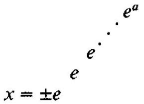
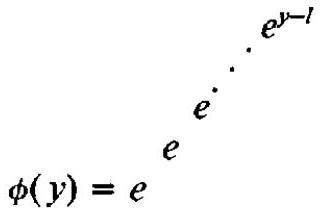
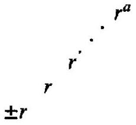

# 1. Introduction

The simplest system of number representation in computers is fixed point, but unfortunately the range of numbers that can be represented in fixed-point arithmetic is severely limited. Sometimes, and particularly in computations arising in linear algebra, the limitations may be circumvented by judicious scaling procedures; see, for example, \[18, p. 99\]. For most types of computation, however, it is difficult or even impossible to devise satisfactory scaling procedures. In consequence, at an early stage in computer development, fixed-point systems largely yielded to floatingpoint systems. In floating point each real number $`x`$ is represented in the form

``` math
x=r^{l} \times a,
```

where $`r`$ is the radix, $`l`$ is a signed integer, and $`a`$ is a signed rational fraction; often $`l`$ and $`a`$ are called the exponent and mantissa, respectively. If the floating-point representation is normalized (and this is usually the case), then $`a`$ has to satisfy

``` math
\frac{1}{r} \leq|a|<1,
```

This work was supported, in part, by the U.S. Army Research Office, Durham under contract DAAG 29-80-C-0032, the U.S. National Science Foundation under Grant MCS 81-11725, and grants from the U.K. Science and Engineering Research Council.

Authors’ addresses: C. W. Clenshaw, Department of Mathematics, Cartmel College, University of Lancaster, Bailrigg, Lancaster, LA1 4YL, England; F. W. J. Olver, Institute for Physical Science and Technology, University of Maryland, College Park, MD 20742.\
Permission to copy without fee all or part of this material is granted provided that the copies are not made or distributed for direct commercial advantage, the ACM copyright notice and the title of the publication and its date appear, and notice is given that copying is by permission of the Association for Computing Machinery. To copy otherwise, or to republish, requires a fee and/or specific permission.\
© 1984 ACM 0004-5411/84/0400-0319 \$00.75\
except when $`x=0`$. Obviously the normalized floating-point form of each representable nonzero number $`x`$ is unique once $`r`$ has been specified.

For a given word length, numbers of much greater magnitude can be accommodated in floating-point form than in fixed-point form. This gain is achieved at some cost, however. First, arithmetic operations are more complicated and take somewhat longer to perform. Second, the very ability to represent larger numbers implies that some precision must be sacrificed: some digits of each word are allocated to the exponent and are thus not available to the mantissa.

Failures caused by overflow or underflow are rarer with floating-point systems than they are with fixed-point systems. Nevertheless, they are not sufficiently rare to be negligible; indeed the possibility of overflow or underflow is of continuing concern to designers of mathematical software. $`{ }^{1}`$ To overcome such failures, it may be necessary to disturb the original mathematical analysis of a problem by scaling or other artifices. For example, one might compute the ratios of successive members of a rapidly growing sequence rather than the actual members.

Because of continued rapid advances in computer technology, it is opportune to pose the following question. Is it possible to devise a number system for use in computers in which problems of overflow and underflow are abolished, thereby avoiding the need to tamper with the mathematical analysis of a problem? Naturally we would expect such a system to be achievable only at some cost, just as the floating-point system costs in speed and precision compared with the fixed-point system. One answer is to increase the amount of storage allocated to the exponent to one or more words, as in multiple-precision packages \[1,2\] or extended-range packages \[11, 17\]. However, this is only a partial answer; furthermore, it is inefficient to allocate a great deal of storage to the exponent when it will be used only occasionally.

In this paper we propose another answer based on the representation of numbers as generalized exponential functions, and we shall show that such a system enjoys several mathematical advantages in addition to freedom from overflow and underflow. Generalized exponentials are not new to mathematicians; they have been discussed by Hardy \[7\], and Littlewood \[10\] briefly discussed similar functions with base $`e`$ replaced by 10 . However, the present paper may be the first in which generalized exponentials have been proposed seriously as a basis for computation. $`{ }^{2}`$ The feasibility of such a system will depend on the development of satisfactory algorithms for addition and subtraction, including error analysis, and ultimately on the construction of hardware chips for implementing these processes in a fast and accurate manner.

# 2. Generalized Exponentials and Logarithms

Let $`x`$ be any real number and\


? =0 [^1]

??=0 [^2]

where the process of exponentiation is performed $`l`$ times, $`l`$ being a nonnegative integer. (When $`l=0`$, we have $`x= \pm a`$.) Then we call the right-hand side a generalized exponential function and denote it more concisely as

``` math
\begin{equation*}
x= \pm[1 / a] . \tag{2}
\end{equation*}
```

The integer $`l`$ is called the level of $`x`$ and the fractional part $`a`$ the index of $`x`$, and we refer to $`[l / a]`$ as a level-index (li) form. If we restrict $`a`$ by

``` math
\begin{equation*}
0 \leq a<1, \tag{3}
\end{equation*}
```

then the li form is normalized. By repeatedly taking logarithms, we can see that the normalized li form of any nonzero real number is unique. Henceforth we shall suppose that every number in li form is normalized, except where stated otherwise.

The range of absolute values of all numbers that can be accommodated at level $`l`$ is the interval $`\left[e_{l}, e_{l+1}\right)`$, where the sequence $`\left\{e_{l}\right\}`$ is defined by $`e_{0}=0`$ and

``` math
e_{l}=e^{e_{l-1}}, \quad l \geq 1 .
```

Approximate values of the first few members of this sequence are given by

``` math
\begin{aligned}
& e_{0}=0, \quad e_{1}=1, \quad e_{2} \fallingdotseq 2.72, \quad e_{3} \fallingdotseq 15.2, \\
& e_{4} \fallingdotseq 3,810,000 \fallingdotseq 10^{6.58} \fallingdotseq 2^{219}, \\
& e_{5} \fallingdotseq 10^{1,660,000} \fallingdotseq 2^{5,500,000} \fallingdotseq 2^{224}, \\
& e_{6} \fallingdotseq 10^{10^{1,660,000}} \fallingdotseq 2^{2^{5,500,000}} .
\end{aligned}
```

From these numbers it is evident that we need not pass beyond level 4 to include all floating-point numbers that are representable on existing computers in singleor double-precision form. These levels also include a substantial fraction of the numbers that are representable in existing multiple-precision packages \[1,2\] or extended-range packages \[11, 17\]. Certainly if we proceed to level 5, then all such numbers are included. And if we proceed to level 6, then we are able to represent numbers that exceed those representable by multiple-precision floating-point packages currently under construction that permit the use of a variable number of words for the exponent.

Of course, it can be argued that because only a finite number of levels can be assigned for use with a given word length, overflow is still possible in the li system. However, the only way to generate numbers of arbitrarily high levels is to perform operations that are equivalent to iterated exponentiation, and this is not often performed in ordinary computations. By assigning three bits to represent the level, thereby permitting the use of levels 0 to 7 , we would virtually abolish overflow from everyday work.

From an analytical standpoint, a more satisfactory notation for generalized exponentials is as follows. Let $`\phi(y)`$ be defined by the relations

``` math
\begin{array}{ll}
\phi(y)=y, & 0 \leq y<1, \\
\phi(y)=e^{\phi(y-1)}, & y \geq 1, \tag{5}
\end{array}
```

or equivalently,\
\
where $`l=\operatorname{int}[y]`$ and the exponentiations are carried out $`l`$ times. This determines $`\phi(y)`$ for all nonnegative values of $`y`$. It is easily verified that $`\phi(y)`$ and $`\phi^{\prime}(y)`$ are continuous, that is, $`\phi(y) \in C^{1}[0, \infty)`$. The function that is inverse to $`x=\phi(y)`$ we call a generalized logarithm and denote it by $`y=\psi(x)`$. From (4) and (5) it is seen that

``` math
\begin{equation*}
\psi(x)=x, \quad 0 \leq x<1, \tag{7}
\end{equation*}
```

and

``` math
\begin{equation*}
\psi(x)=\psi(\ln x)+1, \quad x \geq 1 ; \tag{8}
\end{equation*}
```

furthermore $`\psi(x) \in C^{1}[0, \infty) .^{3}`$ Explicitly,

``` math
\begin{equation*}
\psi(x)=l+\ln ^{(l)} x, \quad x \geq 0, \tag{9}
\end{equation*}
```

where $`\ln ^{(l)} x`$ denotes the $`l`$ th iterated logarithm of $`x`$ and the nonnegative integer $`l`$ is determined (uniquely) by

``` math
\begin{equation*}
0 \leq \ln ^{(l)} x<1 . \tag{10}
\end{equation*}
```

When $`x`$ is nonnegative and expressed in level-index form (2), we have

``` math
\begin{equation*}
\psi(x)=l+a . \tag{11}
\end{equation*}
```

# 3. Advantages of the li System

In this section we show that the li system offers several advantages in addition to overcoming the problem of overflow.\
3.1 Redistributed Precision. For a given word length the total number of representable numbers is the same, whether the system used be fixed point, floating point, level index, or any other that has been proposed. $`{ }^{4}`$ The interval between consecutive representable numbers is an inverse measure of the local precision of the system.

In the fixed-point system all nonnegative real representable numbers lie in the interval $`[0,1)`$ and they are equispaced. Since the li system covers a larger interval, its precision in the interval $`[0,1)`$ is necessarily less. If, as suggested in Section 2, the number of bits assigned to the level is 3 , then the spacing between representable numbers in the interval $`[0,1)`$ is eight times larger than in the fixed-point system.

In the floating-point system we need to distinguish between the intervals $`[0,1 / r)`$ and $`[1 / r, \infty)`$ where $`r`$ again denotes the internal radix. The former is covered by use of negative exponents; this is discussed and compared with the li system in Section 4 below. In the interval $`[1 / r, \infty)`$ the spacing between representable numbers jumps by a factor $`r`$ each time the exponent increases by unity, then remains constant until the next change in the exponent. In the li system, however, because the generalized logarithm is a $`C^{1}`$ function, the spacing increases in a smooth manner as we proceed from one level to the next. To begin with, the spacing in the li system is less than in the floating-point system, but eventually the situation is reversed. Again, this is because the set of representable numbers is spread over a larger interval in the li system.

? =0 [^3]

??=0 [^4]

As a typical example, consider the UNIVAC 1100 series computers, for which $`r=2`$. In single precision seven bits are allocated to the exponent and 27 to the mantissa; $`{ }^{5}`$ consequently, except at the jumps, the spacing between consecutive representable numbers is $`2^{p-27}`$, where $`p \in[0,127]`$ is the local exponent. In li form, three bits would be allocated to the level, leaving 31 bits for the index. By differentiating formula (1) we see that the spacing between one representable positive number $`x`$ and the next is $`2^{-31}`$ when $`0<x \leq 1`$, and approximately

``` math
2^{-31} x \ln x \ln ^{(2)} x \ln ^{(3)} x \ldots
```

when $`x>1`$, where the product terminates at the iterated logarithm in the interval $`[1, e)`$. Since $`p=\operatorname{int}\left[\log _{2} x\right]+1`$, the local spacings in the two systems become equal approximately when

``` math
\begin{equation*}
2^{\operatorname{mat}\left[\log _{2} x\right]-26}=2^{-31} x \ln x \ln ^{(2)} x \ln ^{(3)} x \cdots . \tag{12}
\end{equation*}
```

Solving this equation we find that $`x \fallingdotseq 2^{18}`$, or in li form, $`x \fallingdotseq[3 / 0.93]`$. Thus for values of $`x`$ in the interval $`\frac{1}{2} \leq x<2^{18}`$ the local precision of the li system exceeds that of the floating-point system, whereas when $`2^{18}<x<2^{127}`$ the situation is reversed.

The extent of the gain or loss can be assessed from the ratio of the two sides of eq. (12). In the present example, for numbers in the range $`\frac{1}{2}`$ to $`2^{18}`$ the maximum gain in local precision of the li system over the floating-point system is a factor of 16 ; for numbers in the range $`2^{18}`$ to $`2^{127}`$ there is a maximum loss of a factor of about 37 ; for numbers exceeding $`2^{127}`$ the floating-point system fails completely, while the li system is still effective. $`{ }^{6}`$

Is the gain in local precision of the smaller numbers at the expense of that of the larger numbers an asset? The answer depends on the nature of the computations being carried out. In linear algebra, for example, the answer would usually be affirmative since computed numbers are not unduly large as a rule. Consequently the li system would recover much of the advantage of the fixed-point system without the disadvantage of requiring scaling procedures. On the other hand, the smooth behavior of the local precision of the li system would always be an advantage, because it eliminates the undesirable phenomenon known as "wobbling precision" or "radix effect" introduced by the steplike behavior of the local precision of the floating-point system; compare \[4, p. 7\] or \[14, sec. 5\].\
3.2 Transitions between Systems. As we saw in Section 2, fixed-point numbers that are less than unity in magnitude are level-0 numbers, and all floatingpoint numbers having nonnegative exponents that can be represented on existing computers lie within the ranges covered by levels 0 to 5 . However, a major advantage of the li system is that in effect it uses the fixed- and floating-point systems, and permits passage from one to the other, and beyond, in an automatic manner.

For example, all the while numbers generated by an algorithm are less than unity in magnitude, the li system may compute exclusively with level-0 numbers; in this case the system operates in a fixed-point mode. However, as soon as a number in excess of unity appears, the li system moves to level 1 , in effect changing the operating mode from fixed point to floating point (in base $`e`$ ). Similarly, when a number in excess of $`e`$ appears, the li system moves to level 2 , and so on.

? =0 [^5]

??=0 [^6]

Incidentally, by analogy with the floating-point system it might be thought that a more suitable definition for an li number would involve logarithms to base $`r`$ rather than base $`e`$. This would replace (1) by\


However, it is not clear that any real advantage would accrue. There would be a loss of portability introduced by changes in $`r`$. (This is an argument for standardization, rather than any particular choice of base.) More seriously, the undesirable phenomenon of wobbling precision reappears if a base other than $`e`$ is used. This is because the generalized logarithm $`l+\log _{r}^{(l)} x`$ is a $`C^{1}`$ function if $`r=e`$, but only a $`C^{0}`$ function if $`r \neq e`$.\
3.3 Generalized Measures of Precision. The error measures commonly used for fixed- and floating-point arithmetic are absolute error and relative error, respectively. Recently, Olver \[13, 14\] has described advantages of using absolute precision and relative precision instead. Absolute precision is merely another name for maximum absolute error. Thus if $`x`$ and $`\bar{x}`$ are real or complex numbers and $`\alpha`$ is a nonnegative real number such that

``` math
\begin{equation*}
x=\bar{x}+u, \quad \text { where } \quad|u| \leq \alpha, \tag{14}
\end{equation*}
```

then $`\bar{x}`$ is said to be an approximation to $`x`$ of absolute precision $`\alpha`$, and (14) is written equivalently as

``` math
\begin{equation*}
x \simeq \bar{x} ; \quad \text { ap }(\alpha) . \tag{15}
\end{equation*}
```

Relative precision, however, differs from maximum relative error: it is a logarithmic form of absolute precision. Thus if $`x \neq 0`$ and

``` math
\begin{equation*}
x=\bar{x} e^{v}, \quad \text { where } \quad|v| \leq \alpha, \tag{16}
\end{equation*}
```

then $`\bar{x}`$ is said to be an approximation to $`x`$ of relative precision $`\alpha`$, and (16) is written equivalently $`{ }^{7}`$

``` math
\begin{equation*}
x \simeq \bar{x} ; \quad \operatorname{rp}(\alpha) . \tag{17}
\end{equation*}
```

Since

``` math
e^{v}=1+v+O\left(v^{2}\right), \quad v \rightarrow 0,
```

it is clear that although relative precision differs from maximum relative error, the difference amounts only to quantities of the second order.

In the li system, absolute precision and relative precision are to be regarded as special cases of generalized precision (gp), defined as follows. Let $`x`$ and $`\bar{x}`$ be nonnegative numbers such that

``` math
\begin{equation*}
|\psi(x)-\psi(\bar{x})| \leq \alpha, \tag{18}
\end{equation*}
```

where $`\psi(\cdot)`$ again denotes the generalized logarithm defined in Section 2. Then we say that

``` math
\begin{equation*}
x \simeq \bar{x} ; \quad \operatorname{gp}(\alpha) . \tag{19}
\end{equation*}
```

? =0 [^7]

??=0 [^8]

Consequently if $`x=[l / a]`$ and $`\bar{x}=[\bar{l} / \bar{a}]`$, then $`\alpha`$ is an upper bound for $`|(l+a)-(\bar{l}+\bar{a})|`$. In the common case $`l=\bar{l}`$ we have $`|a-\bar{a}| \leq \alpha`$.

The quantity $`|\psi(x)-\psi(\bar{x})|`$ is a metric and may be regarded as a generalized distance. Thus if (19) holds and

``` math
\begin{equation*}
\bar{x} \simeq \overline{\bar{x}} ; \quad \operatorname{gp}(\beta), \tag{20}
\end{equation*}
```

then

``` math
\begin{equation*}
x \simeq \overline{\bar{x}} ; \quad \operatorname{gp}(\alpha+\beta) . \tag{21}
\end{equation*}
```

This is a natural generalization of a well-known property of absolute errors.\
An advantage of the gp concept is that it enables precision requirements to be specified in a more satisfactory manner. For example, suppose that we wish to construct a general-purpose algorithm for generating a mathematical function such as a Bessel function. In the floating-point system we might specify a certain overall maximum relative error (or relative precision). However, this would lead to difficulties in the neighborhoods of zeros of the wanted function. An improvement would be to replace maximum relative error by maximum absolute error in the neighborhoods of the zeros. But the relation of the appropriate bound for the absolute error to that for the relative error is not obvious, and the extent of the "neighborhoods" of the zeros is also vague. Generalized precision would ease-if not completely resolve-the problem in a purely arithmetic and automatic manner. By specifying an overall generalized precision we automatically bound the absolute error when the computed approximation is of level 0 , the relative error when the computed approximation is of level 1 , and the natural generalization of these errors at higher levels.\
3.4 Representation of Large Numbers. Dirac has estimated the ratio $`M`$, say, of the mass of the universe to that of a single proton to be about $`10^{78}`$ (cf. \[6, p. 76\]). The last digit of the exponent is quite uncertain; in consequence it would be impossible to express $`M`$ in fixed-point form in a meaningful manner since there are no significant digits. Even decimal floating-point form $`10^{l} \times a`$ is not really sensible: although there is perhaps one significant digit available in the exponent $`l`$, there are none in the mantissa $`a`$. Representation in li form presents no difficulty, however. For example, we might write $`M`$ in the form

``` math
M \simeq[4 / 0.500] ; \quad \operatorname{gp}(0.003) .
```

This will be a correct statement if

``` math
5.75 \times 10^{76} \leq M \leq 6.47 \times 10^{80} .
```

More impressively, the li system enables this idea to be taken much further. It is easy to record numbers in li form for which neither the mantissa nor the exponent of the floating-point form has any significant figures: even the number of digits in the exponent may not be specifiable. An example is furnished by\
\[5/0.87654\].

If the index is correctly rounded, that is, if we assume the true value $`x`$ is given by

``` math
\begin{equation*}
x \simeq[5 / 0.87654] ; \quad \operatorname{gp}\left(\frac{1}{2} \times 10^{-5}\right), \tag{22}
\end{equation*}
```

then it is impossible to record $`x`$ in either fixed- or floating-point form. Nevertheless the relation (22) specifies a precise interval that contains the true value of $`x`$.

As Littlewood \[10, p. 103\] has pointed out, very large numbers enjoy some interesting arithmetical properties; our li notation proves convenient for their\
display. For example, the best approximation, with the same number of decimals in the index, to twice \[5/0.87654\] is still \[5/0.87654\]; more precisely

``` math
2 \times[5 / 0.87654] \simeq[5 / 0.87654] ; \quad \operatorname{gp}\left(\frac{1}{2} \times 10^{-5}\right) .
```

Even more remarkably, raising \[5/0.87654\] to a substantial power makes no difference. Thus we have

``` math
[5 / 0.87654]^{n} \simeq[5 / 0.87654] ; \quad \operatorname{gp}\left(\frac{1}{2} \times 10^{-5}\right),
```

for any real value of $`n`$ in the interval \[1/4000,4000\]. Obviously these relations simulate accepted "properties" $`2 \times \infty=\infty`$ and $`\infty^{n}=\infty`$ of the "number" $`\infty`$.

# 4. Other Distinguished Points

In framing the definition of li form given in Section 2, our object was to introduce a set of machine-representable numbers that approach the point at infinity much more closely than is possible by machine-representable numbers of other systems. Borrowing from the terminology of asymptotic analysis, we say that $`\infty`$ is the distinguished point associated with our definition. Sometimes, however, we may wish to use a finite distinguished point, say, $`\xi`$. By this we mean that we may wish to employ a set of machine-representable numbers that approach $`\xi`$ extremely closely.

In the floating-point system this requirement is met by introducing negative exponents, possibly augmented, also, by the device known as gradual underflow \[5\]. This solves the problem when 0 is the distinguished point. For any other finite distinguished point $`\xi`$ we translate $`\xi`$ to the origin and again use negative exponents.

Similar extensions may be made in the li system by the simple device of using reciprocals. A very small number $`x`$ may be represented as

``` math
x=[l / a]^{-1}
```

This extension yields a set of numbers that approaches the origin much more closely than the corresponding set of floating-point numbers. It also overcomes the problem of underflow, just as the direct li system overcomes the problem of overflow. For any other finite distinguished point $`\xi`$, we would use the representation

``` math
x=\xi+[/ / a]^{-1} .
```

It needs to be stressed that reciprocal li numbers are to be introduced only when there is a special reason for having a dense set of representable numbers in the neighborhood of the origin (or other distinguished point). For many purposes the set of representable numbers at level 0 will be quite appropriate. In this way, the li system differs significantly from the floating-point system, because without the use of negative exponents or gradual underflow, the nonzero representable floatingpoint numbers that are closest to the origin are $`\pm 1 / r`$.

# 5. Needs

In order to forge the li system into a practicable tool for computer arithmetic, we need satisfactory algorithms for addition and subtraction. These will also permit multiplication and division (at the next higher level), and powering (at a higher level still).

At high levels addition or subtraction can be accomplished trivially. For example, if $`x`$ is any positive number of level 5 and $`y`$ is any nonnegative number not exceeding $`x`$, then

``` math
\begin{equation*}
x+y \simeq x ; \quad \operatorname{gp}\left(2^{-27}\right) . \tag{23}
\end{equation*}
```

In consequence if not more than 26 bits are assigned to represent the index, then $`x`$ is the appropriate approximation to $`x+y`$. At the next level, that is when $`x`$ is of level 6 and again $`0 \leq y \leq x`$, (23) is replaceable by

``` math
\begin{equation*}
x+y \simeq x ; \quad \mathrm{gp}\left(2^{-5502869}\right), \tag{24}
\end{equation*}
```

showing that $`x`$ would be an acceptable approximation to $`x+y`$ on most computers, even if something like 100,000 words were employed to represent the index.

At lower levels proper algorithms for addition and subtraction, based on recurrence relations, are needed. For example, if we wish to form $`[l / a]-[l / b]`$, where $`a>b`$, we set

``` math
\begin{equation*}
c_{j}=[J / a]-[j / b], \quad j=0,1, \ldots, l . \tag{25}
\end{equation*}
```

Then $`c_{0}=a-b`$, and higher members of the sequence $`\left\{c_{j}\right\}`$ satisfy

``` math
\begin{equation*}
c_{j+1}=[(j+1) / a]\left(1-e^{-c}\right) . \tag{26}
\end{equation*}
```

The level and index of $`c_{j+1}`$ are found from (26) by taking logarithms as often as necessary.

Evidently these algorithms will require subroutines, and ultimately hardware chips, for the fast and accurate computation of exponential and logarithmic functions. Some of the analysis developed in \[3\] may be applicable. Also, since it is envisaged that the use of li forms will be confined mainly to internal machine representations, the same subroutines will be needed in input and output.

A second need is to extend the error analysis of \[13\] and \[14\]. Suppose, for example, that $`\bar{x}_{1}`$ and $`\bar{x}_{2}`$ are stored values of exact numbers $`x_{1}`$ and $`x_{2}`$, such that

``` math
x_{1} \simeq \bar{x}_{1} ; \mathrm{gp}\left(\alpha_{1}\right), \quad x_{2} \simeq \bar{x}_{2} ; \mathrm{gp}\left(\alpha_{2}\right) .
```

How do we assign a value to $`\alpha`$ in the relation

``` math
x_{1}+x_{2} \simeq \bar{x}_{1}+\bar{x}_{2} ; \quad \mathrm{gp}(\alpha) ?
```

This is a problem of propagation of inherent errors. Next, if $`\overline{x_{1}}+\overline{x_{2}}`$ denotes the stored value of $`\bar{x}_{1}+\bar{x}_{2}`$, how can we determine $`\gamma`$ in the relation

``` math
\bar{x}_{1}+\bar{x}_{2} \simeq \overline{x_{1}+x_{2}} ; \quad \mathrm{gp}(\gamma) ?
```

This is a problem of propagation of abbreviation errors. $`{ }^{8}`$\
Satisfactory solutions to the foregoing problems are being sought by the authors.

# 6. Conclusions

We have described a number system for use as a basis for computer arithmetic that appears to offer several advantages over existing systems. First, overflow and underflow are virtually abolished. Second, local precision is redistributed. Third, fixed-point and floating-point systems are included as special cases. Fourth, measures of precision can be generalized in a natural manner. Fifth, it is possible to define, and to operate with, numbers that cannot be represented in fixed-point or floating-point form. The disadvantage of the proposed system is that many (but not all) arithmetic operations will be more complicated and slower to implement because of the need to compute exponentials and logarithms. With the increasing speeds of modern computers this loss may be a reasonable price to pay for the advantages, just as some loss of speed and precision was an acceptable price for the adoption of the floating-point system in place of the fixed-point system.

? =0 [^9]

??=0 [^10]

acknowledgments. The authors are pleased to acknowledge valuable comments by Dr. D. W. Lozier, Dr. P. L. Walker, and the referees.

# REFERENCES

1.  Brent, R.P. A Fortran multiple-precision arithmetic package. ACM Trans. Math Softw 4, 1 (Mar. 1978), 57-70.

2.  Brent, R.P. Algorithm 524. MP, A Fortran multiple-precision arithmetic package. ACM Trans. Math Softw. 4, 1 (Mar. 1978), 71-81.

3.  Clenshaw, C.W., and Olver, F.W.J. An unrestricted algorithm for the exponential function. SIAM J. Numer Anal 17 (Apr. 1980), 310-331.

4.  Cody, W.J., Jr., and Waite, W. Sofiware Manual for the Elementary Functions Prentice-Hall, Englewood Cliffs, N.J., 1980.

5.  Coonen, J.T. Underflow and the denormalized numbers. Computer 14 (Mar. 1981), 75-87.

6.  Dirac, P.A.M. Directions in Physics. Wiley-Interscience, New York, 1978.

7.  Hardy, G.H. Orders of Infinity Cambridge University Press, New York, 1924.

8.  Kahan, W. Implementation of Algorithms. Parts I and II. National Technical Information Service, U.S. Department of Commerce, Springfield, Va., 1973.

9.  Kneser, H. Reelle analytische Losungen der Gleichung $`\phi(\phi(x))=e^{x}`$ und verwandter Funktionalgleichung. J Reine Angew. Math. 187 (1948), 56-67.

10. Littlewood, J.E. A Mathematician’s Miscellany. Methuen, London, 1953.

11. Lozier, D.W., and Smith, J.M. Algorithm 567. Extended-range arithmetic and normalized Legendre polynomials. ACM Trans. Math Softw 7, 1 (Mar. 1981), 141-146.

12. Matula, D.W., and Kornerup, P. Foundations of finite precision rational anthmetic. In Fundamentals of Numerical Computation (Computer-Oriented Numerical Analysis), G. Alefeld and R.D. Grigorieff, Eds. Computing, Suppl. 2 (1980), 85-111.

13. Olver, F.W.J. A new approach to error anthmetic. SIAM J Numer. Anal 15 (Apr. 1978), 368-393.

14. Olver, F.W.J. Further developments of rp and ap error analysis. IMA $`J`$ Numer Anal. 2 (1982), 249-274.

15. Parlett, B., Ed. Special Issue on the Proposed IEEE Floating-Point Standard. ACM SIGNUM Newsletter (Oct. 1979), 1-32.

16. Pryce, J.D. Round-off error analysis with fewer tears. Bull Inst Math Appl 17(Feb./Mar. 1981), 40-47.

17. Smith, J.M., Olver, F.W.J., and Lozier, D.W. Extended-range arithmetic and normalized Legendre polynomials. ACM Trans Math Softw 7, 1 (Mar. 1981), 93-105.

18. Wilkinson, J.H. Rounding errors in algebraic processes. National Physical Laboratory, Notes on Applied Science No. 32. H. M. Stationery Office, London, 1963.

[^1]: $`{ }^{1}`$ See, for example, detailed discussions of very large and very small numbers in \[15\].\
    $`{ }^{2}`$ The possibility of using ordinary exponentials, as opposed to generalized exponentials, as a basis is mentioned in \[8, secs. 2 and 14\].

[^2]: $`{ }^{1}`$ See, for example, detailed discussions of very large and very small numbers in \[15\].\
    $`{ }^{2}`$ The possibility of using ordinary exponentials, as opposed to generalized exponentials, as a basis is mentioned in \[8, secs. 2 and 14\].

[^3]: $`{ }^{3}`$ P. L. Walker has drawn our attention to the fact that H. Kneser \[9\] has shown that there exists a real analytic function with the property (8); furthermore, Walker has computed numerical values of this function at the University of Lancaster. For present purposes, however, it is more convenient to adhere to the $`C^{1}`$ functions just defined because of the simplicity of the representations (4) and (7).\
    $`{ }^{4}`$ For example, the fixed-slash and floating-slash rational arithmetic described in \[12\]. These systems, also, suffer from overflow problems.

[^4]: $`{ }^{3}`$ P. L. Walker has drawn our attention to the fact that H. Kneser \[9\] has shown that there exists a real analytic function with the property (8); furthermore, Walker has computed numerical values of this function at the University of Lancaster. For present purposes, however, it is more convenient to adhere to the $`C^{1}`$ functions just defined because of the simplicity of the representations (4) and (7).\
    $`{ }^{4}`$ For example, the fixed-slash and floating-slash rational arithmetic described in \[12\]. These systems, also, suffer from overflow problems.

[^5]: $`{ }^{5}`$ The bits allocated to the signs of the exponent and mantissa are not taken into consideration here because two bits may be used in an analogous manner in the h system; compare again Section 4 below. $`{ }^{6}`$ In double precision on the UNIVAC 1100 senes computers, there is a gam factor of up to 128 for numbers in the range $`1 / 2`$ to $`2^{70}`$ and a loss factor of up to 68 for numbers in the range $`2^{70}`$ to $`2^{1023}`$.

[^6]: $`{ }^{5}`$ The bits allocated to the signs of the exponent and mantissa are not taken into consideration here because two bits may be used in an analogous manner in the h system; compare again Section 4 below. $`{ }^{6}`$ In double precision on the UNIVAC 1100 senes computers, there is a gam factor of up to 128 for numbers in the range $`1 / 2`$ to $`2^{70}`$ and a loss factor of up to 68 for numbers in the range $`2^{70}`$ to $`2^{1023}`$.

[^7]: $`{ }^{7}`$ Another notation that is sometimes useful is $`x=1(\alpha) \bar{x}`$. Here $`1(\alpha)`$ means some number that approximates 1 to $`\operatorname{rp}(\alpha)`$. This is due to Pryce \[16\].

[^8]: $`{ }^{7}`$ Another notation that is sometimes useful is $`x=1(\alpha) \bar{x}`$. Here $`1(\alpha)`$ means some number that approximates 1 to $`\operatorname{rp}(\alpha)`$. This is due to Pryce \[16\].

[^9]: $`{ }^{8}`$ That 1s, chopping or rounding errors.

[^10]: $`{ }^{8}`$ That 1s, chopping or rounding errors.
