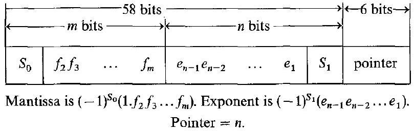
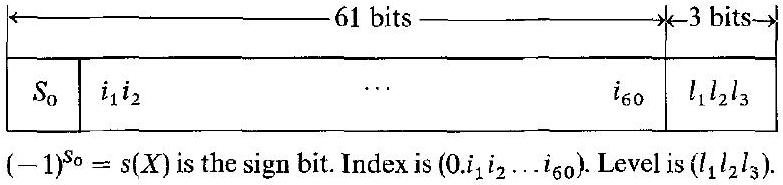
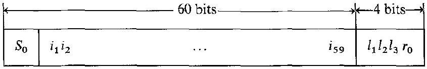

Received October 4, 1988; revised June 23, 1989

AMS 65-04, 65G99, 65H05\
Key words: Level-index, symmetric level-index, root-squaring, polynomial equations\
Das Graeffe-Verfahren mit Höhenindexarithmetik. Das "symmetrische Höhenindexsystem" (sli) zur Zahlendarstellung vereinfacht die Überwachung der Rechengenauigkeit und vermeidet overflow-oder underflow-Probleme. In dieser Arbeit werden die praktischen Vorzüge des Systems am Beispiel des Graeffeverfahrens vorgeführt.

# 1. Introduction

The principal arguments in favour of using level-index, $`l i`$, arithmetic for computational purposes are that (a) it frees the user from concern about overflow and underflow and (b) it provides a consistently useful measure of precision for numbers of arbitrary magnitude. These and other arguments are treated at greater length in \[1\] while details of ways in which the system may be implemented will be found in \[2\] and \[4\]. A good general introduction to the level-index arithmetic system can be found in \[3\].

In order to demonstrate the freedom bestowed by absence of overflow and underflow problems, we examine a method whose application in the past has been beset by these problems. This is the root-squaring method of Graeffe for finding zeros of polynomials. We note that this method was also used by Matsui and Iri \[7\] in a similar way to illustrate the advantages of their proposed system, which was a development of an idea of Morris \[8\] for the generalization of floating-point arithmetic.

In the next section we outline briefly the essentials of level-index arithmetic, and compare it with the suggestion of Matsui and Iri \[7\]. Then follows, in Section 3, a description of Graeffe’s root-squaring method, and in Section 4 a note concerning the precision attainable. In Section 5 we deal with numerical considerations arising from the application of level-index arithmetic to root-squaring, and, in Section 6,\
we give numerical results from test examples. Section 7 includes a discussion of the results, and finally, in Section 8, we examine the conclusions to be drawn from this particular application of li arithmetic.

# 2. Level-index Arithmetic

The basic idea behind level-index ( $`l i`$ ) arithmetic is that any positive real number $`X`$ may be represented within a computer by its mapping $`x=\psi(X)`$ where $`\psi`$ is the generalized logarithm defined by

``` math
\begin{equation*}
\psi(X)=X, \quad X \in[0,1) \tag{2.1}
\end{equation*}
```

and

``` math
\begin{equation*}
\psi(X)=1+\psi(\ln X), \quad X \geq 1 \tag{2.2}
\end{equation*}
```

Thus in order to obtain $`x`$ for any given positive $`X`$, we take natural logarithms as many times as necessary ( $`l`$ times, say) to bring the result to the interval $`[0,1)`$. This result is then the fractional part of $`x`$, called the index of $`X`$, while $`l`$ is the integer part of $`x`$, the level of $`X`$. For example, if $`X=123456`$ to the nearest integer, then (approximately) $`\ln X=11.72364, \ln (\ln X)=2.461607`$ and $`\ln (\ln (\ln X))=`$ 0.9008145 ; thus $`x=3.9008145`$. (We note that here $`d x / d X=2.8 \times 10^{-7}`$, so it is appropriate to record $`x`$ to seven decimal places.)

The inverse function of $`\psi`$ is the generalized exponential function $`\phi`$ defined by

``` math
\begin{equation*}
\phi(x)=x, \quad x \in[0,1) \tag{2.3}
\end{equation*}
```

and

``` math
\begin{equation*}
\phi(x)=e^{\phi(x-1)}, \quad x \geq 1 \tag{2.4}
\end{equation*}
```

so that, for example $`\phi(3.9008145)=123456`$ to the nearest integer.\
As in \[1\], we use the mapping to define a generalized measure of precision, which proves more meaningful than the familiar absolute and relative error measures. The statement that $`X`$ is given by $`\phi(x)`$ to a generalized precision $`\alpha`$ (written $`X \approx \phi(x)`$; $`\mathrm{gp}(\alpha))`$ is equivalent to the statement that $`|\psi(X)-x| \leq \alpha`$.

An extension of the li system known as the symmetric level-index (sli) system represents $`X`$ in precisely the same way as does the $`l i`$ system itself when $`X \geq 1`$, but when $`0<X<1`$ then the reciprocal of $`X`$ is mapped by $`\psi`$.

In standard $`l i`$ arithmetic, any real number $`X`$ is represented by a corresponding number $`x`$ and a sign $`s(X)`$, so that we have

``` math
\begin{equation*}
X=s(X) \phi(x) \tag{2.5}
\end{equation*}
```

In sli arithmetic we write

``` math
\begin{equation*}
X=s(X) \phi(x)^{r(X)} \tag{2.6}
\end{equation*}
```

where $`r(X)`$ is a reciprocation indicator.

The arithmetic scheme proposed by Matsui and Iri \[7\], which we shall call the MI scheme, is essentially a generalization of the familiar floating-point binary system. In this generalization, each word carries the usual floating-point exponent and mantissa with their signs, together with extra information in the form of a pointer and a "level" indicator. We now explain these terms, noting that the MI level is not the same as the li level.

When the number $`\left|\log _{2}(X)\right|`$ is small, the exponent is represented exactly and the level is zero. The pointer indicates how many bits are needed to represent the exponent, and consequently how many are available for the mantissa. As $`X`$ increases, the pointer moves steadily up to the point at which the exact representation of the exponent leaves no bits for the representation of the mantissa. When $`X`$ increases further, the exponent can no longer be represented exactly within the given word-length. Accordingly, level one is used; here the exponent is represented in floating-point form as a level-zero number. Clearly this process may be extended to higher levels, so that very large numbers may be accommodated. (We note that in the particular MI implementation described in \[7\], only level zero is used.)

To compare the nature of these representations in detail, we give in Figure 1 the structure of a 64 -bit word as it might typically appear in (a) MI arithmetic, (b) li arithmetic and (c) sli arithmetic. The first of these is taken from \[7\], and in this case the number of bits, $`B`$, to be allocated to the pointer is determined by the inequalities

<figure data-latex-placement="h">
<div class="center">
<p></p>
</div>
<figcaption>Figure 1 (a). Structure of MI number</figcaption>
</figure>

<figure data-latex-placement="h">
<div class="center">
<p></p>
</div>
<figcaption>Figure 1 (b). Structure of li number</figcaption>
</figure>

<figure data-latex-placement="h">
<div class="center">
<p></p>
</div>
<figcaption>Figure 1 (c). Structure of sli number</figcaption>
</figure>

$`(-1)^{S_{0}}=s(X)`$ is the sign bit. $`(-1)^{r_{0}}=r(X)`$ is the reciprocation sign bit.

``` math
2^{B-1}<64-B \leq 2^{B},
```

which yield $`B=6`$.\
It is noted in \[7\] that the pointer, $`n`$, cannot assume any of the values 58 through 63, and it is suggested that these might be used to indicate ’non-numbers’, higher level representations, etc.

There is evidently a common element in the philosophy underlying the $`l i`$ and MI systems, particularly in the notion of an increasing level. (The same word describes a number playing a similar, though not the same, part.) Henceforth, we concentrate on the $`l i`$ (and sli) system by virtue of its conceptual simplicity and its smoother representation. (The "saw tooth" curve of the MI representation error in Figure 3 of \[7\] may be compared with the corresponding smooth curve which the $`l i`$ system yields. See \[6\].)

It may be thought that in Figures 1(b) and 1(c), the decision concerning the number of bits to be allocated to the level has been resolved arbitrarily. However, practical considerations make it easy to decide that this number should be precisely three. For, in the first place, when numbers are stored to a precision of a million decimal places or less, all addition is trivial at level 6. (That is to say that $`\phi(x)+\phi(y)`$ is indistinguishable from $`\phi(x)`$ when $`x \geq 6`$ and $`y \leq x`$.) Secondly when the storage precision is nine decimal places, not all addition is trivial at level 5.

Similar (though not identical) considerations apply to the operation of subtraction, and then multiplication and division are covered if we raise these levels by unity. Consequently for all practical purposes involving the ordinary arithmetic operations a 3-bit level is both necessary and sufficient. It is clear that the property of triviality implies the existence of a set of numbers which, for any given precision, is closed under these operations. The significance of this result is considered in detail by Lozier and Olver \[6\].

# 3. Root-squaring

The method of Graeffe is based on an iteration, each step of which produces a polynomial whose zeros are the squares of those of the previous polynomial. Now, if

``` math
\begin{equation*}
p(z)=K\left(z-\alpha_{1}\right)\left(z-\alpha_{2}\right) \ldots\left(z-\alpha_{n}\right) \tag{3.1}
\end{equation*}
```

then

``` math
\begin{equation*}
(-1)^{n} p(z) p(-z)=K^{2}\left(z^{2}-\alpha_{1}^{2}\right)\left(z^{2}-\alpha_{2}^{2}\right) \ldots\left(z^{2}-\alpha_{n}^{2}\right) \tag{3.2}
\end{equation*}
```

and this result gives rise to a simple computational formula for producing the coefficients in each polynomial from those of the previous one.

Write

``` math
\begin{gather*}
f_{0}(z)=p(z)  \tag{3.3}\\
f_{r+1}\left(z^{2}\right)=(-1)^{n} f_{r}(z) f_{r}(-z) \tag{3.4}
\end{gather*}
```

and

``` math
\begin{equation*}
f_{r}(z)=\sum_{j=0}^{n}(-1)^{n-j} a_{j}^{(r)} z^{j} \tag{3.5}
\end{equation*}
```

for $`r=0,1,2, \ldots`$.\
Substitution of (3.5) in (3.4) yields, for each $`j`$,

``` math
\begin{equation*}
a_{j}^{(r+1)}=\left(a_{j}^{(r)}\right)^{2}+2 \sum_{k=1}^{m}(-1)^{k} a_{j-k}^{(r)} a_{j+k}^{(r)} \tag{3.6}
\end{equation*}
```

where $`m=\min (j, n-j)`$ and empty sums are taken to be zero.\
For simplicity we consider only the problems in which the polynomial $`p`$ has real coefficients: thus each zero is either real or one of a complex conjugate pair. First we look at the case in which the zeros have distinct absolute values, and are ordered so that

``` math
\begin{equation*}
\left|\alpha_{1}\right|>\left|\alpha_{2}\right|>\cdots>\left|\alpha_{n}\right| . \tag{3.7}
\end{equation*}
```

The salient feature of the root-squaring method is that each step increases the separation of the zeros up to the stage at which they can be deduced from the coefficients in a very simple manner. It is not difficult to show that

``` math
\begin{equation*}
\left|\alpha_{k}\right|=\left|\frac{a_{n-k}^{(r)}}{a_{n-k+1}^{(r)}}\right|^{2^{-r}}\left(1+\xi_{k}^{(r)}\right) \tag{3.8}
\end{equation*}
```

where $`\xi_{k}^{(r)} \rightarrow 0`$ as $`r \rightarrow \infty`$. (The rapidity with which $`\xi_{k}^{(r)}`$ tends to zero will depend on the relative distance of $`\left|\alpha_{k}\right|`$ from its neighbours; the examples of Section 6 will illustrate this dependence.)

In practice we compute the quantities

``` math
\begin{equation*}
\alpha_{k}^{(r)}=\left|a_{n-k}^{(r)} / a_{n-k+1}^{(r)}\right|^{2-r} \tag{3.9}
\end{equation*}
```

for successively increasing $`r`$ until the limit $`\left|\alpha_{k}\right|`$ is displayed numerically. In the case of distinct real roots, the only question remaining concerns the sign of each $`\alpha_{k}`$ : this is readily resolved by evaluating both $`p\left(\mid \alpha_{k}\right) \mid`$ and $`p\left(-\mid \alpha_{k}\right) \mid`$. Now we generalize the problem by allowing that two zeros may share the same modulus, as in the case of a complex conjugate pair. We note that this case may conveniently be taken to include the two special cases of phase zero (a double real zero) and phase $`\pi`$ (equal and opposite zeros). Let there be $`k-1`$ roots (real or complex) with modulus exceeding that of the pair under discussion. Then by analogy with (3.8), the square of the modulus of the pair is given by

``` math
\begin{equation*}
\left|\frac{a_{n-k-1}^{(r)}}{a_{n-k+1}^{(r)}}\right|^{2^{-r}}\left(1+\eta_{k}^{(r)}\right) \tag{3.10}
\end{equation*}
```

where $`\eta_{k}^{(r)} \rightarrow 0`$ as $`r \rightarrow \infty`$. Accordingly in the computational process we compute, along with the $`\alpha_{k}^{(r)}`$ of (3.9), the quantities

``` math
\begin{equation*}
\beta_{k}^{(r)}=\left(\alpha_{k-1}^{(r)} \alpha_{k}^{(r)}\right)^{1 / 2} \tag{3.11}
\end{equation*}
```

in the expectation that the rapid settlement of $`\left\{\beta_{k}^{(r)}\right\}`$ compared with $`\left\{\alpha_{k}^{(r)}\right\}`$, will indicate the presence of a pair of roots of common modulus.

Similar reasoning can be applied to treat arbitrary multiplicities of modulus, but we do not pursue the details here. The root-squaring method is discussed in, for example, \[5\], \[9\] and \[12\].

# 4. Precision

It might be expected that the repeated squaring process, as described by (3.6), must eventually lead to a serious loss of precision in the coefficients $`a_{j}^{(r)}`$, and that we shall reach a stage at which these coefficients will have no correct significant figures. This is indeed the case but, as we now show, it need not be a matter for concern. Traditional measures of significance are inappropriate for situations such as the one under discussion.

We use, here, the definition of relative precision given by Olver \[10\]; that is to say, we write

``` math
\begin{equation*}
\bar{x} \approx x ; \quad \operatorname{rp}(\alpha) \tag{4.1}
\end{equation*}
```

and say that $`\bar{x}`$ represents $`x`$ to relative precision $`\alpha`$, when

``` math
\begin{equation*}
\bar{x}=x e^{u} \quad \text { with }|u| \leq \alpha . \tag{4.2}
\end{equation*}
```

(The more familiar, but less convenient, notion of relative error leads to results closely similar to those which follow. For temporary numerical convenience we now use the decimal base for floating-point arithmetic in this section.)

Suppose that we seek

``` math
\begin{equation*}
t=\left(a \times 10^{b}\right)^{2^{-n}} \quad \text { to } \operatorname{rp}(\gamma) \tag{4.3}
\end{equation*}
```

this being a typical requirement of the root-squaring method. Here, $`b`$ and $`n`$ are integers, $`1 \leq a<10`$ and $`0<\gamma<1`$. It is clear that we shall require $`a^{2-n}`$ and $`10^{b \times 2-n}`$ each to about $`\mathrm{r} p(\gamma)`$. Accordingly the precise value of a will be irrelevant if

``` math
\begin{equation*}
a^{2-n} \approx 1 ; \quad \operatorname{rp}(\gamma) . \tag{4.4}
\end{equation*}
```

This is the case if

``` math
\begin{equation*}
2^{-n} \ln a \leq \gamma, \tag{4.5}
\end{equation*}
```

which is always true if

``` math
\begin{equation*}
2^{-n} \leq \gamma / \ln 10 \tag{4.6}
\end{equation*}
```

Thus we see that whenever

``` math
\begin{equation*}
n \geq(\ln (\ln 10)+\ln 1 / \gamma) / \ln 2 \tag{4.7}
\end{equation*}
```

we may achieve the required $`\operatorname{rp}(\gamma)`$ in $`t`$ without knowing any of the figures in $`a`$.

As a particular example, if we seek $`t`$ to a relative precision of $`10^{-9}`$ after 32 iterations of root-squaring have been performed, it is not necessary that the coefficients $`a_{j}^{(32)}`$ have any correct significant figures.

While it is true that 32 iterations would cause most root-squaring examples to overflow or underflow in conventional floating-point systems, a sequence of this length, or indeed one much longer, is perfectly feasible in sli arithmetic, as our examples will show. Further, we note that the simple analysis of this section has nothing to do with sli arithmetic; it merely demonstrates the weakness of relative error as a general measure of "significance" or "precision". It supports the notion of generalized precision which is in turn fundamental to the $`l i`$ and sli systems of arithmetic.

A more detailed discussion of the precision of $`l i`$ arithmetic will be found in \[6\].

# 5. The application of $`l i`$ arithmetic to root-squaring

In accordance with the notation of Section 3, we suppose that we seek the zeros of the polynomial

``` math
\begin{equation*}
p(z)=f_{0}(z)=\sum_{j=0}^{n} a_{j}^{(0)} z^{j} \tag{5.1}
\end{equation*}
```

where the coefficients $`a_{j}^{(0)}`$ are real. The coefficients $`a_{j}^{(r)}`$ of the polynomial $`f_{r} (r=1,2, \ldots)`$ are of course also real, and are computed using (3.6).\
It is clear that the use of conventional arithmetic will invariably lead to overflow or underflow at quite moderate values of $`r`$. In particular, we see that since the coefficients $`a_{n}^{(r)}`$ and $`a_{0}^{(r)}`$ are merely squared in order to yield $`a_{n}^{(r+1)}`$ and $`a_{0}^{(r+1)}`$ (apart from a possible sign change in the latter) then the larger will soon overflow as $`r`$ increases, or the smaller will underflow, except in the special case where both are exactly unity.\
When li or sli arithmetic is used, these problems disappear. With li arithmetic, a simple scaling to make the smaller of $`\left|a_{n}^{(0)}\right|`$ and $`\left|a_{0}^{(0)}\right|`$ greater than or equal to unity will suffice, and we shall also need the reciprocal of (3.9) on occasion in order to extract roots of numbers exceeding unity. With sli arithmetic, even these simple modifications are unnecessary; for this reason we shall henceforth assume that sli arithmetic is used in the root-squaring process.\
For our primary purpose, namely the demonstration of the utility and power of the sli system, we aim to restrict the output from the root-squaring program to such information as will enable us to determine the modulus of each zero of the polynomial $`p`$, on the assumption that zeros are either isolated and real, or occur in pairs. This output could be augmented in an obvious way to expose higher multiplicities, and (less obviously) to determine the phases of complex zeros, but we do not pursue these possibilities here.

The primary output is the $`n`$-vector $`\left\{\alpha_{k}^{(r)}, k=1,2, \ldots, n\right\}`$ for each $`r`$, as given by (3.9). When the $`k^{\text {th }}`$ zero is an isolated real zero, we expect

``` math
\begin{equation*}
\alpha_{k}^{(r)} \rightarrow\left|\alpha_{k}\right| \quad \text { as } r \rightarrow \infty . \tag{5.2}
\end{equation*}
```

We also output the ( $`2 n`$ )-vector of values of $`p\left( \pm \alpha_{k}\right)`$, in order to resolve the sign ambiguity for the distinct real zeros. The third output vector is the set $`\left\{\beta_{k}^{(r)}, k=\right. 2,3, \ldots, n\}`$ given by (3.11). When the $`k^{\text {th }}`$ and $`(k+1)^{\text {st }}`$ zeros share the same modulus $`\rho`$ we expect

``` math
\begin{equation*}
\beta_{k}^{(r)} \rightarrow|\rho| \quad \text { as } r \rightarrow \infty \tag{5.3}
\end{equation*}
```

Again an extra ( $`2 n-2`$ )-vector of values of $`p\left( \pm \beta_{k}^{(r)}\right)`$ will enable us to distinguish readily the case of real multiplicity from that of complex conjugacy.

Experience gained through computing numerical examples such as those of Section 6 shows that some elements of the array may be very sensitive to rounding errors. This sensitivity shows itself in the considerable variation of those elements from iteration to iteration, particularly in the early stages (small $`r`$ ). It transpires that these "unreliable" elements are precisely the ones which are not directly relevant to our calculations, namely the $`\alpha_{k}`$ relating to pairs of zeros and the nonsignificant $`\beta_{k}`$ such as those for odd $`k`$ in Example $`\mathrm{P}_{\mathrm{C}}`$ below. Thus, far from suggesting misleading results, this phenomenon is of assistance in determining the nature of the zeros.

# 6. Examples

We attacked the following polynomials:

``` math
\begin{array}{ll}
\mathrm{P}_{\mathrm{A}}: & 10000 x^{8}-110000 x^{7}+453500 x^{6}-885500 x^{5}+867524 x^{4} \\
& -432740 x^{3}+109840 x^{2}-13200 x+576 \\
\mathrm{P}_{\mathrm{B}}: & x^{4}-10.43857593020614 x^{3}+40.58740567587410 x^{2} \\
& -69.60408570545396 x+44.36715614906059 \\
\mathrm{P}_{\mathrm{C}}: & 2.03253121 x^{16}+3.4356048 x^{15}+25.1783048 x^{14} \\
& +37.651096 x^{13}+128.218748 x^{12}+166.44768 x^{11} \\
& +345.07256 x^{10}+378.908 x^{9}+524.327 x^{8}+468.88 x^{7} \\
& +443.576 x^{6}+304.08 x^{5}+190.68 x^{4}+89.6 x^{3} \\
& +32.8 x^{2}+8 x+1 \\
\mathrm{P}_{\mathrm{D}}: & \left.\begin{array}{l}
648 x^{14}-1278 x^{13}-3570 x^{12}+13655 x^{11}-9495 x^{10}-34563 x^{9} \\
\\
+ \\
+
\end{array}\right\} 6896 x^{8}-797 x^{7}-34629 x^{6}-15151 x^{5}-45782 x^{4} \\
+ & 103410 x^{3}-65400 x^{2}+58000 x-30000
\end{array}
```

We now discuss each in turn, explaining its origins and giving the results obtained from a root-squaring program using sli arithmetic with an output precision of 14 decimal places. We note that this output precision is a consequence of our compromise implementation of sli arithmetic in which the operational subroutines use

<div class="center">

<table>
<caption>Table 1 Approximation to the first zero of polynomial <span class="math inline">P<sub>A</sub></span></caption>
<tbody>
<tr>
<td style="text-align: center;">Iteration</td>
<td colspan="3" style="text-align: center;">Approximation</td>
</tr>
<tr>
<td style="text-align: center;">1</td>
<td style="text-align: center;">5.50454</td>
<td style="text-align: center;">35778</td>
<td style="text-align: center;">0923</td>
</tr>
<tr>
<td style="text-align: center;">2</td>
<td style="text-align: center;">4.33772</td>
<td style="text-align: center;">15727</td>
<td style="text-align: center;">9568</td>
</tr>
<tr>
<td style="text-align: center;">3</td>
<td style="text-align: center;">4.04979</td>
<td style="text-align: center;">29381</td>
<td style="text-align: center;">0067</td>
</tr>
<tr>
<td style="text-align: center;">4</td>
<td style="text-align: center;">4.00249</td>
<td style="text-align: center;">77320</td>
<td style="text-align: center;">4182</td>
</tr>
<tr>
<td style="text-align: center;">5</td>
<td style="text-align: center;">4.00001</td>
<td style="text-align: center;">25559</td>
<td style="text-align: center;">7190</td>
</tr>
<tr>
<td style="text-align: center;">6</td>
<td style="text-align: center;">4.00000</td>
<td style="text-align: center;">00006</td>
<td style="text-align: center;">3123</td>
</tr>
<tr>
<td style="text-align: center;">7</td>
<td style="text-align: center;">4.00000</td>
<td style="text-align: center;">00000</td>
<td style="text-align: center;">0057</td>
</tr>
<tr>
<td style="text-align: center;">8</td>
<td style="text-align: center;">4.00000</td>
<td style="text-align: center;">00000</td>
<td style="text-align: center;">0059</td>
</tr>
<tr>
<td style="text-align: center;">9</td>
<td style="text-align: center;">4.00000</td>
<td style="text-align: center;">00000</td>
<td style="text-align: center;">0060</td>
</tr>
<tr>
<td style="text-align: center;">10</td>
<td style="text-align: center;">4.00000</td>
<td style="text-align: center;">00000</td>
<td style="text-align: center;">0064</td>
</tr>
</tbody>
</table>

</div>

orthodox floating-point internally while following the general scheme outlined in \[4\]; they also use the standard software for the exponential and logarithmic functions. Thus the analysis of \[2\] relating to the number of guarding figures is not readily applicable to our present situation. We estimate that some 14 decimal places are dependable here. (Current and future implementations, incorporating special function routines and other features such as those discussed in \[11\] and \[13\] will be tested on these examples, and results using arithmetic of genuinely single and double precision will be published in a forthcoming paper.)

With our present program, the array described in Section 5 was output for each example in turn, for a number of iterations which was more than sufficient to reveal the moduli of the zeros. A selection from the output data is given below, with the reasoning leading to the conclusions described, for the examples $`\mathrm{P}_{\mathrm{C}}`$ and $`\mathrm{P}_{\mathrm{D}}`$. The simpler examples $`\mathrm{P}_{\mathrm{A}}`$ and $`\mathrm{P}_{\mathrm{B}}`$ are first treated in a rather more summary fashion.

Example $`\mathbf{P}_{\mathbf{A}}`$ This is essentially the first example used by Matsui and Iri \[7\], though they scaled it differently. It has eight real zeros, namely $`4,3,2,1,0.4,0.3,0.2,0.1`$. Table 1 gives the approximations to the first of these zeros, as supplied by our program, for the first 10 iterations.

There appears to be no consistent improvement after seven iterations, though of course we should expect a higher working precision to show improvement at a later stage. The approximations to the other zeros follow a similar pattern, though they tend to be more accurate. (This is to be expected. The largest zero is also one of the worst conditioned; it is relatively close to its nearest neighbour.)

Example $`\mathbf{P}_{\mathbf{B}}`$ This is the second example used by Matsui and Iri \[7\]. Though still having distinct real zeros, this is a more difficult example than $`\mathrm{P}_{\mathrm{A}}`$ because the zeros are much closer together and therefore, more poorly conditioned. They are given to 15 decimal places by $`2,2.718281828459045,2.720294101765468`$ and 3. (The second and third of these are the 15 decimal place approximations to $`e`$ and $`\sqrt{7.4}`$, respectively.)

The convergence of the root-squaring method is slower here than for the previous polynomial, as will be expected; the results settle to 14 decimal places at iteration 15 rather than at iteration 7 . In Table 2 we give the approximations to the most poorly determined zero- the second largest-for iterations 14 through 17.

<div class="center">

<table>
<caption>Table 2. Approximations to the second zero of polynomial <span class="math inline">P<sub>B</sub></span></caption>
<tbody>
<tr>
<td style="text-align: center;">Iteration</td>
<td colspan="3" style="text-align: center;">Approximation</td>
</tr>
<tr>
<td style="text-align: center;">14</td>
<td style="text-align: center;">2.72029</td>
<td style="text-align: center;">41026</td>
<td style="text-align: center;">3166</td>
</tr>
<tr>
<td style="text-align: center;">15</td>
<td style="text-align: center;">2.72029</td>
<td style="text-align: center;">41017</td>
<td style="text-align: center;">3066</td>
</tr>
<tr>
<td style="text-align: center;">16</td>
<td style="text-align: center;">2.72029</td>
<td style="text-align: center;">41017</td>
<td style="text-align: center;">3064</td>
</tr>
<tr>
<td style="text-align: center;">17</td>
<td style="text-align: center;">2.72029</td>
<td style="text-align: center;">41017</td>
<td style="text-align: center;">3065</td>
</tr>
</tbody>
</table>

</div>

<div class="center">

|        |      |        |      |
|:-------|:-----|:-------|:-----|
| 0.3267 | 0623 | 1.2979 | 0834 |
| 0.5037 | 0908 | 1.4746 | 0057 |
| 0.7857 | 4931 | 1.5963 | 2999 |
| 1.0650 | 0506 | 1.6671 | 2222 |

Table 3. Moduli of the zeros of $`\mathrm{P}_{\mathrm{C}}`$

</div>

It is evident that in this case the ill-conditioning and the rounding of the coefficients to 14 decimal places are sufficient to cause the loss of the last four figures quoted, though the results are still very stable. After 50 iterations the approximate zero is 2.72029410173055 . We note that stability is no guarantee of accuracy.

Again the other zeros are given similarly, though to rather better accuracy.\
Example $`\mathbf{P}_{\mathbf{C}}`$ This sixteenth degree polynomial was used by Olver \[9\] to illustrate the root-squaring method, and it was discussed subsequently by Wilkinson \[14\]. This is a much more difficult problem than the preceding examples; it has eight complex conjugate pairs of zeros which are not known exactly, and some of the moduli are fairly close. Table 3 gives these moduli to 8 decimal places, as computed from Wilkinson’s results.

For this example we examine the array described in Section 5; the array is reproduced in full for iterations 10 and 11 in Table 4. As always, we need to compare successive iterations before drawing conclusions, and on comparing Table 4a with the similar array for the $`11^{\text {th }}`$ iteration, Table 4b, we observe the pattern characteristic of a polynomial with complex zeros. Entries in the $`\alpha`$-column differ in the first five decimal places, while alternate entries in the $`\beta`$-column change only by a unit (or less) in the $`14^{\text {th }}`$ decimal place. Also the absence of any small entries in the $`p( \pm \alpha)`$ columns suggests the absence of real zeros. The persistence of this pattern through many iterations strengthens the belief that there are indeed eight complex pairs of zeros. In particular we note that as many as 100 iterations produced only small end-figure discrepancies.\
Questions concerning the number of accurate figures are treated in the next section.\
We note that the $`\beta_{k}`$ for odd $`k`$ play no part in our deliberations for this example. However, we may need them when both real and complex (or repeated) roots occur in the same problem - as in example $`\mathrm{P}_{\mathrm{D}}`$-so they remain part of our standard output.\
As a final remark on this example, we note that we have made no attempt to establish the phases of the complex zeros; we seek only to compute their moduli.\
Example $`\mathbf{P}_{\boldsymbol{D}}`$ This is an artifical example of deliberate difficulty, a polynomial of degree 14 with real roots (some isolated, some replaced), as well as complex pairs.

<div class="center">

<table>
<caption>Table 4. Example <span class="math inline">P<sub>C</sub>; [±<em>x</em>] ± 1</span> denotes <span class="math inline">±<em>ϕ</em>(<em>x</em>)<sup>+1</sup></span>.</caption>
<thead>
<tr>
<th style="text-align: left;">(a)</th>
<th style="text-align: left;"><span class="math inline"><em>α</em><sub><em>k</em></sub><sup>(10)</sup></span></th>
<th style="text-align: left;">Iteration 10</th>
<th style="text-align: left;"></th>
<th style="text-align: left;"><span class="math inline"><em>β</em><sub><em>k</em></sub><sup>(10)</sup></span></th>
<th style="text-align: left;"><span class="math inline"><em>p</em>(±<em>β</em><sub><em>k</em></sub><sup>(10)</sup>)</span></th>
<th style="text-align: left;"></th>
</tr>
</thead>
<tbody>
<tr>
<td style="text-align: left;">k</td>
<td style="text-align: left;"></td>
<td style="text-align: left;"><span class="math inline"><em>p</em>(±<em>α</em><sub><em>k</em></sub><sup>(10)</sup>)</span></td>
<td style="text-align: left;"></td>
<td style="text-align: left;"></td>
<td style="text-align: left;"></td>
<td style="text-align: left;"></td>
</tr>
<tr>
<td style="text-align: left;">1</td>
<td rowspan="2" style="text-align: left;">1.66314606461118</td>
<td style="text-align: left;">[3.93307487907790]</td>
<td style="text-align: left;"></td>
<td rowspan="2" style="text-align: left;"></td>
<td rowspan="2" style="text-align: left;"></td>
<td style="text-align: left;"></td>
</tr>
<tr>
<td style="text-align: left;"></td>
<td style="text-align: left;">[3.87166914777200]</td>
<td style="text-align: left;">1 1</td>
<td style="text-align: left;"></td>
</tr>
<tr>
<td rowspan="2" style="text-align: left;">2</td>
<td rowspan="2" style="text-align: left;">1.67110730441638</td>
<td style="text-align: left;">[3.93465266099348]</td>
<td style="text-align: left;">1</td>
<td style="text-align: left;">1.66712193221824</td>
<td style="text-align: left;">[3.93386435987946]</td>
<td style="text-align: left;"></td>
</tr>
<tr>
<td style="text-align: left;">[3.87387865845268]</td>
<td style="text-align: left;">1</td>
<td style="text-align: left;"></td>
<td style="text-align: left;">[3.87277541621162]</td>
<td style="text-align: left;">1 1 1 1</td>
</tr>
<tr>
<td style="text-align: left;">3</td>
<td rowspan="2" style="text-align: left;">1.59725002666228</td>
<td style="text-align: left;">[3.91952730450834]</td>
<td style="text-align: left;">1</td>
<td style="text-align: left;">1.63376136156251</td>
<td style="text-align: left;">[3.92714339089611]</td>
<td style="text-align: left;"></td>
</tr>
<tr>
<td style="text-align: left;"></td>
<td style="text-align: left;">[3.85246529124072]</td>
<td style="text-align: left;">1</td>
<td style="text-align: left;"></td>
<td style="text-align: left;">[3.86331299668096]</td>
<td style="text-align: left;"></td>
</tr>
<tr>
<td rowspan="2" style="text-align: left;">4</td>
<td rowspan="2" style="text-align: left;">1.59541061537467</td>
<td style="text-align: left;">[3.91913613516108]</td>
<td style="text-align: left;">1</td>
<td style="text-align: left;">1.59633005608003</td>
<td style="text-align: left;">[3.91933175495725]</td>
<td style="text-align: left;"></td>
</tr>
<tr>
<td style="text-align: left;">[3.85190446253530]</td>
<td style="text-align: left;">1</td>
<td style="text-align: left;"></td>
<td style="text-align: left;">[3.85218497280983]</td>
<td style="text-align: left;"></td>
</tr>
<tr>
<td rowspan="2" style="text-align: left;">5</td>
<td rowspan="2" style="text-align: left;">1.47465706442377</td>
<td style="text-align: left;">[3.89174326760981]</td>
<td style="text-align: left;">1</td>
<td style="text-align: left;">1.53384599442673</td>
<td style="text-align: left;">[3.90560697669967]</td>
<td style="text-align: left;"></td>
</tr>
<tr>
<td style="text-align: left;">[3.81167810027935]</td>
<td style="text-align: left;">1</td>
<td style="text-align: left;"></td>
<td style="text-align: left;">[3.83227752647721]</td>
<td style="text-align: left;"></td>
</tr>
<tr>
<td rowspan="2" style="text-align: left;">6</td>
<td rowspan="2" style="text-align: left;">1.47454441653935</td>
<td style="text-align: left;">[3.89171602547407]</td>
<td style="text-align: left;">1</td>
<td style="text-align: left;">1.47460073940588</td>
<td style="text-align: left;">[3.89172964670275]</td>
<td style="text-align: left;"></td>
</tr>
<tr>
<td style="text-align: left;">[3.81163711271937]</td>
<td style="text-align: left;">1</td>
<td style="text-align: left;"></td>
<td style="text-align: left;">[3.81165760699756]</td>
<td style="text-align: left;"></td>
</tr>
<tr>
<td rowspan="2" style="text-align: left;">7</td>
<td rowspan="2" style="text-align: left;">1.29844686088929</td>
<td style="text-align: left;">[3.84453869220412]</td>
<td style="text-align: left;">1</td>
<td style="text-align: left;">1.38369706543642</td>
<td style="text-align: left;">[3.86858803970847]</td>
<td style="text-align: left;"></td>
</tr>
<tr>
<td style="text-align: left;">[3.73729243770969]</td>
<td style="text-align: left;">1</td>
<td style="text-align: left;"></td>
<td style="text-align: left;">[3.77606745924024]</td>
<td style="text-align: left;"></td>
</tr>
<tr>
<td rowspan="2" style="text-align: left;">8</td>
<td rowspan="2" style="text-align: left;">1.29737007719528</td>
<td style="text-align: left;">[3.84421870598600]</td>
<td style="text-align: left;">1</td>
<td style="text-align: left;">1.29790835737578</td>
<td style="text-align: left;">[3.84437871936698]</td>
<td style="text-align: left;"></td>
</tr>
<tr>
<td style="text-align: left;">[3.73676307947394]</td>
<td style="text-align: left;">1</td>
<td style="text-align: left;"></td>
<td style="text-align: left;">[3.73702783834693]</td>
<td style="text-align: left;">1</td>
</tr>
<tr>
<td rowspan="2" style="text-align: left;">9</td>
<td rowspan="2" style="text-align: left;">1.06439906932003</td>
<td style="text-align: left;">[3.76307079346559]</td>
<td style="text-align: left;">1</td>
<td style="text-align: left;">1.17512531362843</td>
<td style="text-align: left;">[3.80486379510696]</td>
<td style="text-align: left;">1</td>
</tr>
<tr>
<td style="text-align: left;">[3.58832633414886]</td>
<td style="text-align: left;">1</td>
<td style="text-align: left;"></td>
<td style="text-align: left;">[3.66860212889093]</td>
<td style="text-align: left;">1</td>
</tr>
<tr>
<td style="text-align: left;">10</td>
<td style="text-align: left;">1.06561140524894</td>
<td style="text-align: left;">[3.76356590935380]</td>
<td style="text-align: left;">1</td>
<td style="text-align: left;">1.06500506477846</td>
<td style="text-align: left;">[3.76331839410274]</td>
<td style="text-align: left;">1</td>
</tr>
<tr>
<td style="text-align: left;"></td>
<td style="text-align: left;"></td>
<td style="text-align: left;">[3.58933383292988]</td>
<td style="text-align: left;">1</td>
<td style="text-align: left;"></td>
<td style="text-align: left;">[3.58883035604599]</td>
<td style="text-align: left;">1</td>
</tr>
<tr>
<td style="text-align: left;">11</td>
<td style="text-align: left;">0.78541133490559</td>
<td style="text-align: left;">[3.61778162140190] [3.19498204645570]</td>
<td style="text-align: left;">1</td>
<td style="text-align: left;">0.91484603966306</td>
<td style="text-align: left;">[3.69407154533327]</td>
<td style="text-align: left;">1</td>
</tr>
<tr>
<td style="text-align: left;"></td>
<td style="text-align: left;"></td>
<td style="text-align: left;"></td>
<td style="text-align: left;">1</td>
<td style="text-align: left;"></td>
<td style="text-align: left;">[3.43059320397607]</td>
<td style="text-align: left;">1</td>
</tr>
<tr>
<td style="text-align: left;">12</td>
<td style="text-align: left;">0.78608740472176</td>
<td style="text-align: left;">[3.61823244996279]</td>
<td style="text-align: left;">1</td>
<td style="text-align: left;">0.78574929710117</td>
<td style="text-align: left;">[3.61800706599742]</td>
<td style="text-align: left;">1</td>
</tr>
<tr>
<td style="text-align: left;"></td>
<td style="text-align: left;"></td>
<td style="text-align: left;">[3.19666454271630]</td>
<td style="text-align: left;">1</td>
<td style="text-align: left;"></td>
<td style="text-align: left;">[3.19582396362344]</td>
<td style="text-align: left;">1</td>
</tr>
<tr>
<td rowspan="2" style="text-align: left;">13</td>
<td style="text-align: left;">0.50314131625887</td>
<td style="text-align: left;">[3.34676096993871]</td>
<td style="text-align: left;">1</td>
<td style="text-align: left;">0.62889828391102</td>
<td style="text-align: left;">[3.49265056176106]</td>
<td style="text-align: left;">1</td>
</tr>
<tr>
<td style="text-align: left;"></td>
<td style="text-align: left;">[1.27938079122101]</td>
<td style="text-align: left;">1</td>
<td style="text-align: left;"></td>
<td style="text-align: left;">[2.53661610364335]</td>
<td style="text-align: left;">1</td>
</tr>
<tr>
<td rowspan="2" style="text-align: left;">14</td>
<td rowspan="2" style="text-align: left;">0.50427747088770</td>
<td style="text-align: left;">[3.34835559234466]</td>
<td style="text-align: left;">1</td>
<td style="text-align: left;">0.50370907323785</td>
<td style="text-align: left;">[3.34755861557262]</td>
<td style="text-align: left;">1</td>
</tr>
<tr>
<td style="text-align: left;">[1.29262944018392]</td>
<td style="text-align: left;">1</td>
<td style="text-align: left;"></td>
<td style="text-align: left;">[1.28600178361854]</td>
<td style="text-align: left;">1</td>
</tr>
<tr>
<td rowspan="2" style="text-align: left;">15</td>
<td rowspan="2" style="text-align: left;">0.32684189548890</td>
<td style="text-align: left;">[2.98038569807433]</td>
<td style="text-align: left;">1</td>
<td style="text-align: left;">0.40597906896450</td>
<td style="text-align: left;">[3.18151296805469]</td>
<td style="text-align: left;"></td>
</tr>
<tr>
<td style="text-align: left;">[2.43635494800124]</td>
<td style="text-align: left;">-1</td>
<td style="text-align: left;"></td>
<td style="text-align: left;">[1.83839158083109]</td>
<td style="text-align: left;">-1</td>
</tr>
<tr>
<td rowspan="2" style="text-align: left;">16</td>
<td rowspan="2" style="text-align: left;">0.32657060913236</td>
<td style="text-align: left;">[2.97954733273584]</td>
<td style="text-align: left;">1</td>
<td style="text-align: left;">0.32670622415220</td>
<td style="text-align: left;">[2.97996651609702]</td>
<td style="text-align: left;">1</td>
</tr>
<tr>
<td style="text-align: left;">[2.43741207006024]</td>
<td style="text-align: left;">-1</td>
<td style="text-align: left;"></td>
<td style="text-align: left;">[2.43688434591883]</td>
<td style="text-align: left;">-1</td>
</tr>
</tbody>
</table>

</div>

The complete array for iteration 10 is given in Table 5. These results are compared with those of iteration 11 which are not displayed for the sake for brevity.\
We see that there is a clear indication of isolated real roots $`-\alpha_{1}, \alpha_{9}`$ and $`\alpha_{12}`$, for there are small residuals at the corresponding approximations for iterations 10 and 11, and agreement between these two iterations. $`\beta_{6}`$ indicates a pair of real zeros with modulus close to $`5 / 3`$ (since $`\beta_{6}^{(10)}`$ is close to $`\beta_{6}^{(11)}`$, even though $`\alpha_{5}^{(10)}, \alpha_{6}^{(10)}`$ are far from $`\left.\alpha_{5}^{(11)}, \alpha_{6}^{(11)}\right)`$ and the small residual $`p\left(\beta_{6}^{(10)}\right)`$ indicates that this is a repeated real zero. $`\beta_{8}`$ similarly indicates a pair of roots with modulus. $`1.414213 \ldots`$; the residuals $`p\left(\beta_{8}^{(10)}\right)`$ show that this is a pair of equal and opposite real zeros. At $`\beta_{11}`$ we see a complex conjugate pair (again, agreement between successive iterations, but with no small residuals) and similarly at $`\beta_{14}`$. This simple investigation leaves the $`2^{\text {nd }}, 3^{\text {rd }}`$ and $`4^{\text {th }}`$ zeros unresolved. If we examine the array after many more iterations, we see only slow changes; for example after 39 and 40 iterations we have the results shown in Table 6.

This slow convergence suggests the possibility of three zeros with very similar modulus; but, of course, our array is designed to reveal duplications, not triplications. We could extend the array with this in mind, by computing

<div class="center">

<table>
<caption>Table 4. (continued)</caption>
<thead>
<tr>
<th style="text-align: left;">(b)</th>
<th style="text-align: left;"></th>
<th style="text-align: left;">Iteration 11</th>
<th style="text-align: left;"></th>
<th style="text-align: left;"></th>
<th style="text-align: left;"></th>
<th style="text-align: left;"></th>
</tr>
</thead>
<tbody>
<tr>
<td style="text-align: left;">k</td>
<td style="text-align: left;"><span class="math inline"><em>α</em><sub><em>k</em></sub><sup>(11)</sup></span></td>
<td style="text-align: left;"><span class="math inline"><em>p</em>(±<em>α</em><sub><em>k</em></sub><sup>(11)</sup>)</span></td>
<td style="text-align: left;"></td>
<td style="text-align: left;"><span class="math inline"><em>β</em><sub><em>k</em></sub><sup>(11)</sup></span></td>
<td style="text-align: left;"><span class="math inline"><em>p</em>(±<em>β</em><sub><em>k</em></sub><sup>(11)</sup>)</span></td>
<td style="text-align: left;"></td>
</tr>
<tr>
<td rowspan="2" style="text-align: left;">1</td>
<td rowspan="2" style="text-align: left;">1.66768319843956</td>
<td style="text-align: left;">[3.93397556289873]</td>
<td style="text-align: left;">1</td>
<td style="text-align: left;"></td>
<td style="text-align: left;"></td>
<td style="text-align: left;"></td>
</tr>
<tr>
<td style="text-align: left;">[3.87293112992786]</td>
<td style="text-align: left;">1</td>
<td style="text-align: left;"></td>
<td style="text-align: left;"></td>
<td style="text-align: left;"></td>
</tr>
<tr>
<td rowspan="2" style="text-align: left;">2</td>
<td rowspan="2" style="text-align: left;">1.66656085489358</td>
<td style="text-align: left;">[3.93375313341476]</td>
<td style="text-align: left;">1</td>
<td style="text-align: left;">1.66712193221824</td>
<td style="text-align: left;">[3.93386435987946]</td>
<td style="text-align: left;">1</td>
</tr>
<tr>
<td style="text-align: left;">[3.87261964235207]</td>
<td style="text-align: left;">1</td>
<td style="text-align: left;"></td>
<td style="text-align: left;">[3.87277541621162]</td>
<td style="text-align: left;">1</td>
</tr>
<tr>
<td rowspan="2" style="text-align: left;">3</td>
<td rowspan="2" style="text-align: left;">1.59650657730580</td>
<td style="text-align: left;">[3.91936929060719]</td>
<td style="text-align: left;">1</td>
<td style="text-align: left;">1.63115767671859</td>
<td style="text-align: left;">[3.92660945579074]</td>
<td style="text-align: left;">1</td>
</tr>
<tr>
<td style="text-align: left;">[3.85223878687086]</td>
<td style="text-align: left;">1</td>
<td style="text-align: left;"></td>
<td style="text-align: left;">[3.86255689042390]</td>
<td style="text-align: left;">1</td>
</tr>
<tr>
<td rowspan="2" style="text-align: left;">4</td>
<td rowspan="2" style="text-align: left;">1.59615355437171</td>
<td style="text-align: left;">[3.91929421671990]</td>
<td style="text-align: left;">1</td>
<td style="text-align: left;">1.59633005608003</td>
<td style="text-align: left;">[3.91933175495725]</td>
<td style="text-align: left;">1</td>
</tr>
<tr>
<td style="text-align: left;">[3.85213115168245]</td>
<td style="text-align: left;">1</td>
<td style="text-align: left;"></td>
<td style="text-align: left;">[3.85218497280983]</td>
<td style="text-align: left;">1</td>
</tr>
<tr>
<td rowspan="2" style="text-align: left;">5</td>
<td rowspan="2" style="text-align: left;">1.47453963398100</td>
<td style="text-align: left;">[3.89171486881232]</td>
<td style="text-align: left;">1</td>
<td style="text-align: left;">1.53414200054647</td>
<td style="text-align: left;">[3.90567412679820]</td>
<td style="text-align: left;">1</td>
</tr>
<tr>
<td style="text-align: left;">[3.81163537240139]</td>
<td style="text-align: left;">1</td>
<td style="text-align: left;"></td>
<td style="text-align: left;">[3.83237607278214]</td>
<td style="text-align: left;">1</td>
</tr>
<tr>
<td rowspan="2" style="text-align: left;">6</td>
<td rowspan="2" style="text-align: left;">1.47466184736300</td>
<td style="text-align: left;">[3.89174442421462]</td>
<td style="text-align: left;">1</td>
<td style="text-align: left;">1.47460073940588</td>
<td style="text-align: left;">[3.89172964670275]</td>
<td style="text-align: left;">1</td>
</tr>
<tr>
<td style="text-align: left;">[3.81167984042092]</td>
<td style="text-align: left;">1</td>
<td style="text-align: left;"></td>
<td style="text-align: left;">[3.81165760699756]</td>
<td style="text-align: left;">1</td>
</tr>
<tr>
<td rowspan="2" style="text-align: left;">7</td>
<td rowspan="2" style="text-align: left;">1.29722218460831</td>
<td style="text-align: left;">[3.84417472354802]</td>
<td style="text-align: left;">1</td>
<td style="text-align: left;">1.38309944081933</td>
<td style="text-align: left;">[3.86842780412944]</td>
<td style="text-align: left;">1</td>
</tr>
<tr>
<td style="text-align: left;">[3.73669028971893]</td>
<td style="text-align: left;">1</td>
<td style="text-align: left;"></td>
<td style="text-align: left;">[3.77581540794162]</td>
<td style="text-align: left;">1</td>
</tr>
<tr>
<td rowspan="2" style="text-align: left;">8</td>
<td rowspan="2" style="text-align: left;">1.29859489309811</td>
<td style="text-align: left;">[3.84458264929519]</td>
<td style="text-align: left;">1</td>
<td style="text-align: left;">1.29790835737579</td>
<td style="text-align: left;">[3.84437871936698]</td>
<td style="text-align: left;">1</td>
</tr>
<tr>
<td style="text-align: left;">[3.73736512774313]</td>
<td style="text-align: left;">1</td>
<td style="text-align: left;"></td>
<td style="text-align: left;">[3.73702783834693]</td>
<td style="text-align: left;">1</td>
</tr>
<tr>
<td rowspan="2" style="text-align: left;">9</td>
<td rowspan="2" style="text-align: left;">1.06527744125892</td>
<td style="text-align: left;">[3.76342960934855]</td>
<td style="text-align: left;">1</td>
<td style="text-align: left;">1.17616488850478</td>
<td style="text-align: left;">[3.80522602801137]</td>
<td style="text-align: left;">1</td>
</tr>
<tr>
<td style="text-align: left;">[3.58905662760073]</td>
<td style="text-align: left;">1</td>
<td style="text-align: left;"></td>
<td style="text-align: left;">[3.66925943981732]</td>
<td style="text-align: left;">1</td>
</tr>
<tr>
<td style="text-align: left;">10</td>
<td style="text-align: left;">1.06473275794084</td>
<td style="text-align: left;">[3.76320716162122]</td>
<td style="text-align: left;">1</td>
<td style="text-align: left;">1.06500506477846</td>
<td style="text-align: left;">[3.76331839410274]</td>
<td style="text-align: left;">1</td>
</tr>
<tr>
<td style="text-align: left;"></td>
<td style="text-align: left;"></td>
<td style="text-align: left;">[3.58860397447696]</td>
<td style="text-align: left;">1</td>
<td style="text-align: left;"></td>
<td style="text-align: left;">[3.58883035604599]</td>
<td style="text-align: left;">1</td>
</tr>
<tr>
<td rowspan="2" style="text-align: left;">11</td>
<td rowspan="2" style="text-align: left;">0.78592618717917</td>
<td style="text-align: left;">[3.61812500132432]</td>
<td style="text-align: left;">1</td>
<td style="text-align: left;">0.91476847169828</td>
<td style="text-align: left;">[3.69403109671107]</td>
<td style="text-align: left;">1</td>
</tr>
<tr>
<td style="text-align: left;">[3.19626394689898]</td>
<td style="text-align: left;">1</td>
<td style="text-align: left;"></td>
<td style="text-align: left;">[3.43048867761108]</td>
<td style="text-align: left;">1</td>
</tr>
<tr>
<td rowspan="2" style="text-align: left;">12</td>
<td rowspan="2" style="text-align: left;">0.78557244683620</td>
<td style="text-align: left;">[3.61788911407180]</td>
<td style="text-align: left;">1</td>
<td style="text-align: left;">0.78574929710117</td>
<td style="text-align: left;">[3.61800706599742]</td>
<td style="text-align: left;">1</td>
</tr>
<tr>
<td style="text-align: left;">[3.19538361402320]</td>
<td style="text-align: left;">1</td>
<td style="text-align: left;"></td>
<td style="text-align: left;">[3.19582396362345]</td>
<td style="text-align: left;">1</td>
</tr>
<tr>
<td style="text-align: left;">13</td>
<td style="text-align: left;">0.50386705495002</td>
<td style="text-align: left;">[3.34778028637527]</td>
<td style="text-align: left;">1</td>
<td style="text-align: left;">0.62914551197417</td>
<td style="text-align: left;">[3.49288824502603]</td>
<td style="text-align: left;">1</td>
</tr>
<tr>
<td style="text-align: left;"></td>
<td style="text-align: left;"></td>
<td style="text-align: left;">[1.28784397105253]</td>
<td style="text-align: left;">1</td>
<td style="text-align: left;"></td>
<td style="text-align: left;">[2.53820999561874]</td>
<td style="text-align: left;">1</td>
</tr>
<tr>
<td style="text-align: left;">14</td>
<td style="text-align: left;">0.50355114105902</td>
<td style="text-align: left;">[3.34733689305704]</td>
<td style="text-align: left;">1</td>
<td style="text-align: left;">0.50370907323785</td>
<td style="text-align: left;">[3.34755861557262]</td>
<td style="text-align: left;">1</td>
</tr>
<tr>
<td style="text-align: left;"></td>
<td style="text-align: left;"></td>
<td style="text-align: left;">[1.28416011142277]</td>
<td style="text-align: left;">1</td>
<td style="text-align: left;"></td>
<td style="text-align: left;">[1.28600178361854]</td>
<td style="text-align: left;">1</td>
</tr>
<tr>
<td rowspan="2" style="text-align: left;">15</td>
<td rowspan="2" style="text-align: left;">0.32653433275288</td>
<td style="text-align: left;">[2.97943517341545]</td>
<td style="text-align: left;">1</td>
<td style="text-align: left;">0.40549566687285</td>
<td style="text-align: left;">[3.18051210599014]</td>
<td style="text-align: left;">1</td>
</tr>
<tr>
<td style="text-align: left;">[2,43755298744877]</td>
<td style="text-align: left;">-1</td>
<td style="text-align: left;"></td>
<td style="text-align: left;">[1.84365091441854]</td>
<td style="text-align: left;">-1</td>
</tr>
<tr>
<td rowspan="2" style="text-align: left;">16</td>
<td rowspan="2" style="text-align: left;">0.32687820603711</td>
<td style="text-align: left;">[2.98049785655510]</td>
<td style="text-align: left;">1</td>
<td style="text-align: left;">0.32670622415220</td>
<td style="text-align: left;">[2.97996651609702]</td>
<td style="text-align: left;">1</td>
</tr>
<tr>
<td style="text-align: left;">[2.43621301509407]</td>
<td style="text-align: left;">-1</td>
<td style="text-align: left;"></td>
<td style="text-align: left;">[2.43688434591883]</td>
<td style="text-align: left;">-1</td>
</tr>
</tbody>
</table>

</div>

$`\gamma_{k}^{(r)}=\left(\alpha_{k-2}^{(r)} \alpha_{k-1}^{(r)} \alpha_{k}^{(r)}\right)^{1 / 3}`$ in analogy with (3.11). If we do so, a triple is revealed after a small number of iterations, with at least one real root at -2 . (We emphasize that the decision to extend the array to a $`\gamma`$-column is an ad hoc decision based on observation of the initial results. The $`\gamma`$ ’s should not form part of the standard output for general problems: triplications are not to be expected, but duplications must be.)

Our conclusion is that the zeros of $`\mathrm{P}_{\mathrm{D}}`$ are approximately as shown in Table 7; these values being deduced from iterations 10 and 11 .

# 7. Accuracy considerations

The previous section presented results which demonstrate the ability of the rootsquaring method, implemented in sli arithmetic, to give useful results. It is pertinent to ask, however, how meaningful these results are, particularly in the light of our observation that the stability of the procedure through many iterations is not a sure indicator of accuracy. An obvious numerical experiment can be made to test the sensitivity of our results to rounding errors: a test polynomial may be simply scaled, by multiplying each of its coefficients by the same constant $`K`$, say, before repeating

<div class="center">

| k | $`\alpha_{k}^{(10)}`$ | $`p\left( \pm \alpha_{k}^{(10)}\right)`$ |  | $`\beta_{k}^{(10)}`$ | $`p\left( \pm \beta_{k}^{(10)}\right)`$ |  |
|:---|:---|:---|:---|:---|:---|:---|
| 1 | 2.31237647787152 | \[4.01576326389222\] \[3.90307296757064\] | 1 -1 |  |  |  |
| 2 | 1.95977873402839 | \[3.91434499764033\] \[3.927902060761220\] | 1 1 | 2.12878985491760 | \[3.97360414323500\] \[-3.96974834023348\] | 1 1 |
| 3 | 2.00016078777021 | \[3.93137606887548\] \[-3.67512474462557\] | 1 1 | 1.97986680777004 | \[3.92311703703905\] \[3.90713538488153\] |  |
| 4 | 2.04088266744541 | \[3.94641513170820\] \[-3.93444724555156\] | 1 1 | 2.02041913569046 | \[3.93909242828714\] \[-3.91089253762885\] | 1 1 |
| 5 | 1.66779521821806 | \[2.33112195692192\] \[3.95029146536699\] | -1 1 | 1.84493207292560 | \[3.84646463238930\] \[3.9558596726904\] | 1 1 |
| 6 | 1.66553887877075 | \[2.34854857504526\] \[3.95004512185302\] | -1 1 | 1.66666666666437 | \[4.06931586867569\] \[3.95016880628101\] | -1 1 |
| 7 | 1.41517116999438 | \[2.66976438637781\] \[3.69800654487441\] | 1 1 | 1.53525978379593 | \[3.62559718897801\] \[3.92587594535703\] | 1 1 |
| 8 | 1.41325660274334 | \[-2.66799164372710\] \[-3.69772407136798\] | 1 1 | 1.41421356237542 | \[4.05673599717207\] \[3.92261804103378\] | -1 -1 |
| 9 | 1.20126536676056 | \[-4.08922902562647\] \[-3.92213072487545\] | -1 1 | 1.30295671885956 | \[-3.59769879290383\] \[-3.90946181799193\] | 1 1 |
| 10 | 1.00000000000000 | \[3.70533444232518\] \[-3.92358170908464\] | 1 1 | 1.09602252110099 | \[3.66550681884250\] \[-3.92504514072812\] | 1 |
| 11 | 1.00000000000000 | \[3.70533444232518\] \[-3.92358170908464\] | 1 1 | 1.00000000000000 | \[3.70533444232518\] \[-3.92358170908464\] | 11 |
| 12 | 0.74999999999934 | \[-4.06003154461810\] \[-3.91023431656315\] | -1 1 | 0.86602540378406 | \[3.70084734296961\] \[-3.91769717929753\] | 1 1 |
| 13 | 0.70758558490781 | \[-3.66204731725957\] \[-3.90711796420531\] | 1 1 | 0.72848417188048 | \[-3.60370966135972\] \[-3.90867534223799\] | 1 1 |
| 14 | 0.70662830145921 | \[-3.66384329068752\] \[-3.90704566387311\] | 1 1 | 0.70710678118685 | \[-3.66295147349345\] \[-3.90708181205614\] | 1 1 |

Table 5. Example $`\mathrm{P}_{\mathrm{D}}`$; Iteration 10.

</div>

the calculations. This changes the roundings while leaving the essential problem unaltered. In cases where rigorous confirmation of accuracy is required, such tests are highly desirable, particularly for complex zeros. We note that for real zeros, the standard output yields small residuals, while the complex zeros have no corresponding confirmation. Moreover, if we compute the derivative of the polynomial at our approximate real zero (a straightforward computation) we shall have full information about the sensitivity of the zero (and may also refine it by using Newton’s rule).

When scaling in the manner suggested, we might expect that a judicious choice of $`K`$ will optimize the accuracy attained. We have carried out simple experiments which suggest that, though this may be true, it is not easy to find the right $`K`$. A "common sense" choice, such as that which minimizes the largest value of $`\phi(x)`$ used in the sli representation of the coefficients, sometimes resulted in an improvement, but sometimes gave worse answers. In no case was the change very great. (It is possible that optimal accuracy will result from an optimal scaling at every iteration, but an investigation of this possibility is beyond the scope of our present task.)

# 8. Observations and conclusions

Significant inferences may be drawn from examination of our results, as follows.\
(i) The application of a simple root-squaring routine using a crude implementation

<div class="center">

<table>
<caption>Table 6. Example <span class="math inline">P<sub>D</sub></span> : Partial output for iterations 39 and 40 relating to the zeros of modulus about 2.</caption>
<thead>
<tr>
<th style="text-align: left;">k</th>
<th style="text-align: left;"><span class="math inline"><em>α</em><sub><em>k</em></sub><sup>(39)</sup></span></th>
<th style="text-align: left;"><span class="math inline"><em>p</em>(±<em>α</em><sub><em>k</em></sub><sup>(39)</sup>)</span></th>
<th style="text-align: left;"></th>
<th style="text-align: left;"><span class="math inline"><em>β</em><sub><em>k</em></sub><sup>(39)</sup></span></th>
<th style="text-align: left;"><span class="math inline"><em>p</em>(±<em>β</em><sub><em>k</em></sub><sup>(39)</sup>)</span></th>
<th style="text-align: left;"></th>
</tr>
</thead>
<tbody>
<tr>
<td rowspan="2" style="text-align: left;"></td>
<td rowspan="2" style="text-align: left;">1.99999999999696</td>
<td style="text-align: left;">[3.93131280565293]</td>
<td style="text-align: left;">1</td>
<td style="text-align: left;">2.15052387936900</td>
<td style="text-align: left;">[3.97947043399665]</td>
<td style="text-align: left;">1</td>
</tr>
<tr>
<td style="text-align: left;">[3.86114381158631]</td>
<td style="text-align: left;">-1</td>
<td style="text-align: left;"></td>
<td style="text-align: left;">[-3.9735508431311]</td>
<td style="text-align: left;">1</td>
</tr>
<tr>
<td rowspan="2" style="text-align: left;"></td>
<td rowspan="2" style="text-align: left;">1.99999999999976</td>
<td style="text-align: left;">[3.93131280565403]</td>
<td style="text-align: left;">1</td>
<td style="text-align: left;">1.99999999999836</td>
<td style="text-align: left;">[3.93131280565348]</td>
<td style="text-align: left;">1</td>
</tr>
<tr>
<td style="text-align: left;">[3.94796045807609]</td>
<td style="text-align: left;">-1</td>
<td style="text-align: left;"></td>
<td style="text-align: left;">[3.88481454545794]</td>
<td style="text-align: left;">-1</td>
</tr>
<tr>
<td rowspan="2" style="text-align: left;">4</td>
<td rowspan="2" style="text-align: left;">2.00000000000114</td>
<td style="text-align: left;">[3.93131280565457]</td>
<td style="text-align: left;">1</td>
<td style="text-align: left;">2.00000000000045</td>
<td style="text-align: left;">[3.93131280565430]</td>
<td style="text-align: left;">1</td>
</tr>
<tr>
<td style="text-align: left;">[-3.89771293236361]</td>
<td style="text-align: left;">-1</td>
<td style="text-align: left;"></td>
<td style="text-align: left;">[-3.92857052278219]</td>
<td style="text-align: left;">-1</td>
</tr>
<tr>
<td style="text-align: left;">k</td>
<td style="text-align: left;"><span class="math inline"><em>α</em><sub><em>k</em></sub><sup>(40)</sup></span></td>
<td style="text-align: left;"><span class="math inline"><em>p</em>(±<em>α</em><sub><em>k</em></sub><sup>(40)</sup>)</span></td>
<td style="text-align: left;"></td>
<td style="text-align: left;"><span class="math inline"><em>β</em><sub><em>k</em></sub><sup>(40)</sup></span></td>
<td style="text-align: left;"><span class="math inline"><em>p</em>(±<em>β</em><sub><em>k</em></sub><sup>(40)</sup>)</span></td>
<td style="text-align: left;"></td>
</tr>
<tr>
<td rowspan="2" style="text-align: left;">2</td>
<td rowspan="2" style="text-align: left;">1.99999999999922</td>
<td style="text-align: left;">[3.93131280565382]</td>
<td style="text-align: left;">1</td>
<td style="text-align: left;">2.15052387937021</td>
<td style="text-align: left;">[3.97947043399697]</td>
<td style="text-align: left;">1</td>
</tr>
<tr>
<td style="text-align: left;">[3.91036291081549]</td>
<td style="text-align: left;">-1</td>
<td style="text-align: left;"></td>
<td style="text-align: left;">[-3.97355084313131]</td>
<td style="text-align: left;">1</td>
</tr>
<tr>
<td rowspan="2" style="text-align: left;">3</td>
<td rowspan="2" style="text-align: left;">1.99999999999979</td>
<td style="text-align: left;">[3.93131280565404]</td>
<td style="text-align: left;">1</td>
<td style="text-align: left;">1.99999999999950</td>
<td style="text-align: left;">[3.93131280565393]</td>
<td style="text-align: left;">1</td>
</tr>
<tr>
<td style="text-align: left;">[3.95021157855109]</td>
<td style="text-align: left;">-1</td>
<td style="text-align: left;"></td>
<td style="text-align: left;">[3.92509014174394]</td>
<td style="text-align: left;">-1</td>
</tr>
<tr>
<td rowspan="2" style="text-align: left;">4</td>
<td rowspan="2" style="text-align: left;">1.99999999999877</td>
<td style="text-align: left;">[3.93131280565364]</td>
<td style="text-align: left;">1</td>
<td style="text-align: left;">1.99999999999928</td>
<td style="text-align: left;">[3.93131280565384]</td>
<td style="text-align: left;">1</td>
</tr>
<tr>
<td style="text-align: left;">[3.89498377970053]</td>
<td style="text-align: left;">-1</td>
<td style="text-align: left;"></td>
<td style="text-align: left;">[3.91328262229615]</td>
<td style="text-align: left;">-1</td>
</tr>
</tbody>
</table>

</div>

<div class="center">

<table>
<caption>Table 7. Estimated zeros of <span class="math inline"><em>P</em><sub><em>D</em></sub></span></caption>
<tbody>
<tr>
<td colspan="4" style="text-align: left;">Zeros</td>
</tr>
<tr>
<td style="text-align: left;">-2.31237</td>
<td style="text-align: left;">64778</td>
<td style="text-align: left;">7152</td>
<td style="text-align: left;">Real</td>
</tr>
<tr>
<td style="text-align: left;">+1.66666</td>
<td style="text-align: left;">66666</td>
<td style="text-align: left;">6437</td>
<td style="text-align: left;">Double real</td>
</tr>
<tr>
<td style="text-align: left;">+1.20126</td>
<td style="text-align: left;">53667</td>
<td style="text-align: left;">6056</td>
<td style="text-align: left;">Real</td>
</tr>
<tr>
<td style="text-align: left;">+0.74999</td>
<td style="text-align: left;">99999</td>
<td style="text-align: left;">9934</td>
<td style="text-align: left;">Real</td>
</tr>
<tr>
<td style="text-align: left;">-2.0000</td>
<td style="text-align: left;">00000</td>
<td style="text-align: left;">0000</td>
<td style="text-align: left;">Real</td>
</tr>
<tr>
<td style="text-align: left;"><span class="math inline">±1.41421</span></td>
<td style="text-align: left;">35623</td>
<td style="text-align: left;">7542</td>
<td style="text-align: left;">Real (equal and opposite)</td>
</tr>
<tr>
<td style="text-align: left;">Moduli</td>
<td style="text-align: left;"></td>
<td style="text-align: left;"></td>
<td style="text-align: left;"></td>
</tr>
<tr>
<td style="text-align: left;">1.00000</td>
<td style="text-align: left;">00000</td>
<td style="text-align: left;">0000</td>
<td style="text-align: left;">Complex conjugate pair</td>
</tr>
<tr>
<td style="text-align: left;">0.70710</td>
<td style="text-align: left;">67811</td>
<td style="text-align: left;">8685</td>
<td style="text-align: left;">Complex conjugate pair</td>
</tr>
<tr>
<td style="text-align: left;">2.00000</td>
<td style="text-align: left;">00000</td>
<td style="text-align: left;">0000</td>
<td style="text-align: left;">Pair</td>
</tr>
</tbody>
</table>

</div>

of sli arithmetic gives useful results on widely differing examples. Many iterations may be performed without serious accumulation of rounding errors.\
(ii) The output array described in Sections 5 and 6 is sufficient to deal with any problem in which not more than two zeros share the same modulus. Obvious extensions can be applied to deal with higher multiplicities.\
(iii) From our limited experience, we suggest that an initial examination be made at the $`10^{\text {th }}`$ and $`11^{\text {th }}`$ iterations, in order to make deductions about the moduli of the zeros. In cases of doubt, there is no price to pay (beyond that of computing time) for further iterations; also the possibility of higher multiplicity might be considered.\
(iv) For an estimation of the accuracy attained, we suggest a repeat calculation with a different scaling. We expect that well-conditioned zeros will show slight change, while poorly conditioned zeros may change significantly. It is likely that figures which do not change are reliable; confidence may be further increased of course by yet more runs with different scaling.

In conclusion, we observe the fundamental feature of this investigation: the very large and very small numbers which occur naturally in the root-squaring method are absorbed easily by the sli system. We note that it will be easy to produce a\
program which will not require its user to be aware of the properties of sli arithmetic. Indeed the only places where sli numbers appear in our present output are in the residual columns $`p( \pm \alpha k)`$ and $`p( \pm \beta k)`$ which are examined solely for the purpose of deciding whether or not they are small. If desired these values could be replaced in the output by their floating-point exponents (where, indeed, these are not too large in absolute value.) However, we believe that the sli form, in which the residuals may always be output, is the appropriate one for this purpose.

# Acknowledgment

We are grateful for the programming assistance of Mr F. Golam-Hossen and Mr I. Reid. The former spent a year with us under a grant from the University of Lancaster during which he prepared the programs described above for the University’s DEC VAX 11/785.\
We are also indebted to F. W. J. Olver and I. Reid for several helpful discussions on the presentation of this material.\
This work has been partially funded by US Naval Academy Research Council grant 001618FE58Z.

# References

\[1\] C. W. Clenshaw and F. W. J. Olver, Beyond floating-point, J ACM 31 (1984) 319-328.\
\[2\] C. W. Clenshaw and F. W. J. Olver, Level-index arithmetic operations, SIAM J on Num Anal 24 (1987) 470-485.\
\[3\] C. W. Clenshaw, F. W. J. Olver and P. R. Turner, Level-index arithmetic: An introductory Survey, Numerical Analysis, and Parallel Processing, (P. R. Turner, Ed.) 95-168, Springer, Berlin-Heidelberg-New York-Tokyo-Hong Kong: Lecture Notes in Mathematics 1397, 1989.\
\[4\] C. W. Clenshaw and P. R. Turner, The symmetric level-index system, IMA J Num Anal, 8 (1988) 517-526.\
\[5\] P. Henrici, Applied and Computational Complex Analysis, Vol III, Wiley, London, 1986.\
\[6\] D. W. Lozier and F. W. J. Olver, Closure and precision in computer arithmetic, Manuscript.\
\[7\] S. Matsui and M. Iri, An overflow/underflow-free floating-point representation of numbers, J Inf Proc 4 (1981) 123-133.\
\[8\] R. Morris, Tapered floating-point: A new floating-point representation, IEEE Trans on Computers 20 (1973) 1678-1679.\
\[9\] F. W. J. Olver, The evaluation of zeros of high-degree polynomials, Phil Trans Royal Soc A244 (1952) 385-415.\
\[10\] F. W. J. Olver, A new approach to error arithmetic, SIAM J Num Anal 15 (1978) 368-393.\
\[11\] F. W. J. Olver and P. R. Turner, Implementation of level-index arithmetic using partial table look-up, Proc ARITH8 (M. J. Irwin and R. Stefanelli, Eds.) pp. 144-147, IEEE Computer Society, Washington DC, 1987.\
\[12\] A. Ralston, A first course in numerical analysis, McGraw-Hill, New York, 1965.\
\[13\] P. R. Turner, Towards a fast implementation of level-index arithmetic, Bull IMA 22 (1986) 188-191.\
\[14\] J. H. Wilkinson, Rounding errors in numerical processes, National Physical Lab., Notes on Applied Science, HMSO, London, 1963.

Dr. C. W. Clenshaw,\
Department of Mathematics,\
University of Lancaster,\
Lancaster,\
United Kingdom

Dr. P. R. Turner,\
Department of Mathematics, University of Lancaster, Lancaster, United Kingdom,\
and\
Mathematics Department, US Navel Academy, Annapolis, MD 21402, U.S.A.
