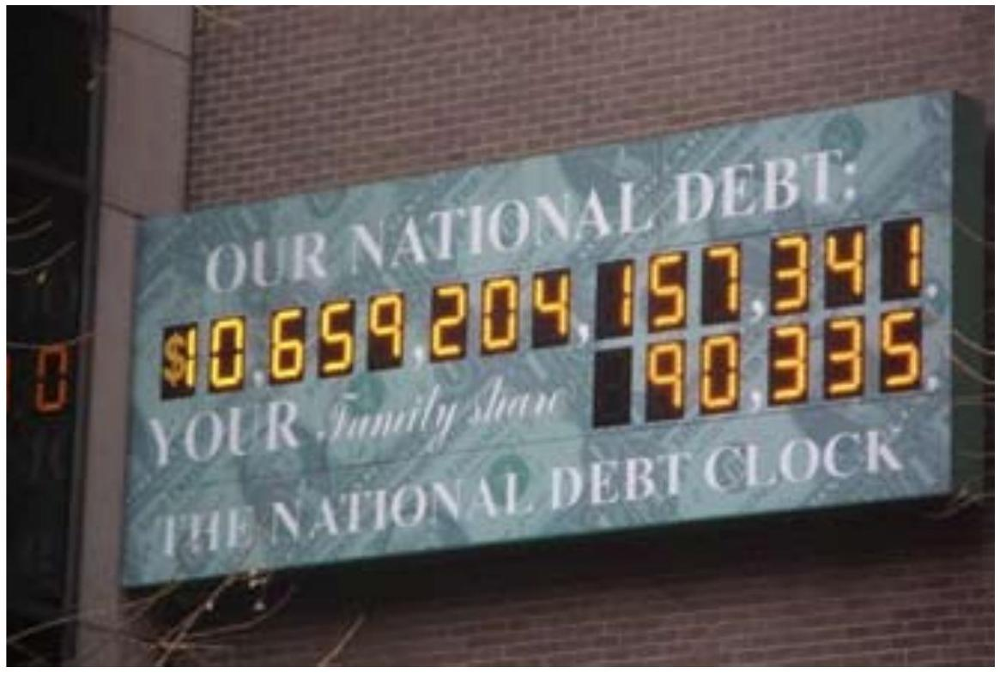
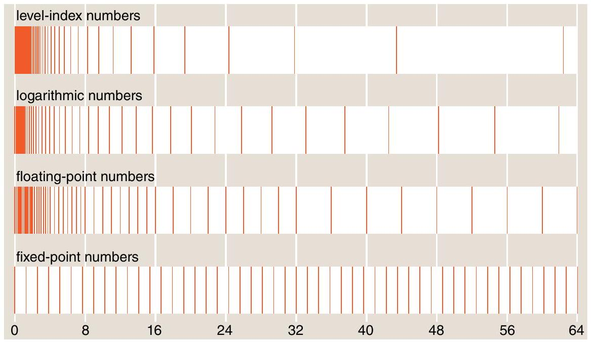
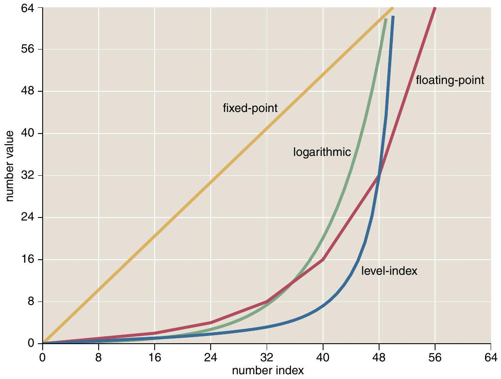

---
author:
- Brian Hayes
title: The Higher Arithmetic
---

# A reprint from

American Scientist\
the magazine of Sigma Xi, The Scientific Research Society
=========================================================

This reprint is provided for personal and noncommercial use. For any other use, please send a request Brian Hayes by electronic mail to <bhayes@amsci.org>.

Last year the National Debt Clock in New York City ran out of digits. The billboard-size electronic counter, mounted on a wall near Times Square, overflowed when the public debt reached $`\$ 10`$ trillion, or $`10^{13}`$ dollars. The crisis was resolved by squeezing another digit into the space occupied by the dollar sign. Now a new clock is on order, with room for growth; it won’t fill up until the debt reaches a quadrillion ( $`10^{15}`$ ) dollars.

The incident of the Debt Clock brings to mind a comment made by Richard Feynman in the 1980s-back when mere billions still had the power to impress:

<div class="displayquote">

There are $`10^{11}`$ stars in the galaxy.\
That used to be a huge number. But it’s only a hundred billion. It’s less than the national deficit! We used to call them astronomical numbers. Now we should call them economical numbers.

</div>

The important point here is not that high finance is catching up with the sciences; it’s that the numbers we encounter everywhere in daily life are growing steadily larger. Computer technology is another area of rapid numeric inflation. Data storage capacity has gone from kilobytes to megabytes to gigabytes, and the latest disk drives hold a terabyte ( $`10^{12}`$ bytes). In the world of supercomputers, the current state of the art is called petascale computing ( $`10^{15}`$ operations per second), and there is talk of a coming transition to exascale $`\left(10^{18}\right)`$. After that, we can await the arrival of zettascale ( $`10^{21}`$ ) and yottascale ( $`10^{24}`$ ) machines-and then we run out of prefixes!

Even these numbers are puny compared with the prodigious creations of

? =0 [^1]

??=0 [^2]

# How to count to a zillion without falling off the end of the number line

pure mathematics. In the 18th century the largest known prime number had 10 digits; the present record-holder runs to almost 13 million digits. The value of $`\pi`$ has been calculated to a trillion digits-a feat at once magnificent and mind-numbing. Elsewhere in mathematics there are numbers so big that even trying to describe their size requires numbers that are too big to describe. Of course none of these numbers are likely to turn up in everyday chores such as balancing a checkbook. On the other hand, logging into a bank’s web site involves doing arithmetic with numbers in the vicinity of $`2^{128}`$, or $`10^{38}`$. (The calculations take place behind the scenes, in the cryptographic protocols meant to ensure privacy and security.)

Which brings me to the main theme of this column: Those streams of digits that make us so dizzy also present challenges for the design of computer hardware and software. Like the National Debt Clock, computers often set rigid limits on the size of numbers. When routine calculations begin to bump up against those limits, it’s time for a rethinking of numeric formats and algorithms. Such a transition may be upon us soon, with the approval last year of a revised standard for one common type of computer arithmetic, called floating point. Before the new standard becomes too deeply entrenched, perhaps it’s worth pausing to examine a\
few alternative schemes for computing with astronomical and economical and mathematical numbers.

# Numerical Eden

In their native habitat-which is not the digital computer-numbers are boundless and free-ranging. Along the real number line are infinitely many integers, or whole numbers. Between any two integers are infinitely many rational numbers, such as $`\frac{3}{2}`$ and $`\frac{5}{4}`$. Between any two rationals are infinitely many irrationals-numbers like $`\sqrt{2}`$ or $`\pi`$.

The reals are a Garden of Eden for doing arithmetic. Just follow a few simple rules-such as not dividing by zero-and these numbers will never lead you astray. They form a safe, closed universe. If you start with any set of real numbers, you can add and subtract and multiply all day longand divide, too, except by zero-and at the end you’ll still have real numbers. There’s no risk of slipping through the cracks or going out of bounds.

Unfortunately, digital computers exist only outside the gates of Eden. Out here, arithmetic is a treacherous process. Even simple counting can get you in trouble. With computational numbers, adding 1 over and over eventually brings you to a largest numbersomething unknown in mathematics. If you try to press on beyond this limit, there’s no telling what will happen. The next number after the largest number might be the smallest number; or it might be something labeled $`\infty`$; or the machine might sound an alarm, or die in a puff of smoke.

This is a lawless territory. On the real number line, you can always rely on principles like the associative law: $`(a+b)+c=a+(b+c)`$. In some versions of computer arithmetic, that law breaks down. (Try it with $`a=10^{30}, b=-10^{30}`$, $`c=1`$.) And when calculations include irrational numbers-well, irrationals just don’t exist in the digital world. They\
have to be approximated by rationalsthe very thing they are defined not to be. As a result, mathematical identities such as $`(\sqrt{2})^{2}=2`$ are not to be trusted.

# Bignums

The kind of computer arithmetic that comes closest to the mathematical ideal is calculation with integers and rationals of arbitrary size, limited only by the machine’s memory capacity. In this "bignum" arithmetic, an integer is stored as a long sequence of bits, filling up as much space as needed. A rational number is a pair of such integers, interpreted as a numerator and a denominator.

A few primitive computers from the vacuum-tube era had built-in hardware for doing arithmetic on integers of arbitrary size, but our sophisticated modern machines have lost that capability, and so the process has to be orchestrated by software. Adding two integers proceeds piece by piece, starting with the least-significant bits and working right to left, much as a paper-and-pencil algorithm sums pairs of digits one at a time, propagating any carries to the next column. The usual practice is to break up the sequence of bits into blocks the size of a machine register-typically 32 or 64 bits. Algorithms for multiplication and division follow similar principles; operations on rationals require the further step of reducing a fraction to lowest terms.

Looking beyond integers and rationals, there have even been efforts to include irrational numbers in exact computations. Of course there’s no hope of expressing the complete value of $`\pi`$ or $`\sqrt{ } 2`$ in a finite machine, but a program can calculate the values incrementally, supplying digits as they are needed-a strategy known as lazy computing. For example, the assertion $`\pi<3.1414`$ could be tested-and shown to be false-by generating the first five decimal digits of $`\pi`$. Another approach is to treat irrational numbers as unevaluated units, which are carried through the computation from start to finish as symbols; thus the circumference of a circle of unit radius would be given simply as $`2 \pi`$.

The great virtue of bignum arithmetic is exactness. If the machine ever gives an answer, it will be the right answer (barring bugs and hardware failures). But there’s a price to pay: You may get no answer at all. The program could run out of memory, or it could\
take so long that it exhausts human patience or the human lifespan.

For some computations, exactness is crucial, and bignum arithmetic is the only suitable choice. If you want to search for million-digit primes, you have to look at every last digit. Similarly, the security module in a web browser must work with the exact value of a cryptographic key.

For many other kinds of computations, however, exactness is neither needed nor helpful. Using exact rational arithmetic to calculate the interest on a mortgage loan yields an unwieldy fraction accurate to hundreds of decimal places, but knowing the answer to the nearest penny would suffice. In many cases the inputs to a computation come from physical measurements accurate to no more than a few significant digits; lavishing exact calculations on these measurements cannot make them any more accurate.

# What’s the Point?

Most computer arithmetic is done not with bignums or exact rationals but with numbers confined to a fixed allotment of space, such as 32 or 64 bits. The hardware operates on all the bits at once, so arithmetic can be very fast. But an implacable law governs all such fixed-size formats: If a number is represented by 32 bits, then it can take on\
at most $`2^{32}`$ possible values. You may be able to choose which $`2^{32}`$ values are included, but there’s no way to increase the size of the set.

For 32 -bit numbers, one obvious mapping assigns the $`2^{32}`$ bit patterns to the integers from 0 through $`4,294,967,295`$ (which is $`2^{32}-1`$ ). The same range of integers could be shifted along the number line, or the values could be scaled to cover a smaller numeric range in finer increments (perhaps 0.00 up to $`42,949,672.95`$ ) or spread out over a wider range more sparsely. Arithmetic done in this style is known as "fixed point," since the position of the decimal point is the same in all numbers of a given class.

Fixed-point arithmetic was once the mainstay of numerical computing, and it still has a place in certain applications, such as high-speed signal processing. But the dominant format now is floating point, where the decimal point (or binary point) can be moved around to represent a wide range of magnitudes. The floating-point format is based on the same idea as scientific notation. Just as we can write a large number succinctly as $`6.02 \times 10^{23}`$, float-ing-point arithmetic stores a number in two parts: the significand ( 6.02 in this example) and the exponent (23).

Designing a floating-point format entails a compromise between range

<figure data-latex-placement="h">
<div class="center">
<p></p>
</div>
<figcaption>Numerical overflow led to some quick re-engineering of the National Debt Clock, an electronic billboard in Midtown Manhattan. The clock was designed to display 13 digits, with a dollar sign in the leftmost position. In the fall of 2008, when the public debt crossed the <span class="math inline">$10</span> trillion threshold, the dollar-sign position was commandeered for a 14th digit. According to news reports, the clock will be replaced with a new model that won’t overflow until the debt reaches $1 quadrillion. The photograph was made by Rafael Chamorro on November 29, 2008.</figcaption>
</figure>

and precision. Every bit allocated to the significand doubles its precision; but the bit has to be taken from the exponent, and it therefore reduces the range by half. For 32-bit numbers the prevailing standard dictates a 24-bit significand and an 8-bit exponent; a few stray bits are lost to storing signs and marking special cases, leaving an effective range of $`2^{-126}`$ up to $`2^{127}`$. In decimal notation the largest representable number is about $`3 \times 10^{38}`$. Standard 64-bit numbers allocate 53 bits to the significand and 11 to the exponent, allowing a range up to about $`10^{308}`$.

The idea of floating-point arithmetic goes back to the beginning of the computer age, but it was widely adopted only in the 1980s. The key event was the drafting of a standard, approved by the Institute of Electrical and Electronic Engineers (IEEE) in 1985. This effort was led by William Kahan of the University of California, Berkeley, who remains a strong advocate of the technology.

Early critics of the floating-point approach worried about efficiency and complexity. In fixed-point arithmetic, many operations can be reduced to a single machine instruction, but float-ing-point calculations are more involved. First you have to extract the significands and exponents, then operate on these pieces separately, then do some rounding and adjusting, and finally reassemble the parts.

The answer to these concerns was to implement floating-point algorithms in hardware. Even before the IEEE\
standard was approved, Intel designed a floating-point coprocessor for early personal computers. Later generations incorporated a floating-point unit on the main processor chip. From the programmer’s point of view, floatingpoint arithmetic became part of the infrastructure.

# Safety in Numbers

It’s tempting to pretend that floatingpoint arithmetic is simply real-number arithmetic in silicon. This attitude is encouraged by programming languages that use the label real for floatingpoint variables. But of course floatingpoint numbers are not real numbers; at best they provide a finite model of the infinite real number line.

Unlike the real numbers, the float-ing-point universe is not a closed system. When you multiply two floatingpoint numbers, there’s a good chance that the product-the real product, as calculated in real arithmetic-will not be a floating-point number. This leads to three kinds of problems.

The first problem is rounding error. A number that falls between two float-ing-point values has to be rounded by shifting it to one or the other of the nearest representable numbers. The resulting loss of accuracy is usually small and inconsequential, but circumstances can conspire to produce numerical disasters. A notably risky operation is subtracting one large quantity from another, which can wipe out all the significant digits in the small differ-\


? =0 [^3]

??=0 [^4]

ence. Textbooks on numerical analysis are heavy with advice on how to guard against such events; mostly it comes down to "Don’t do that."

The second problem is overflow, when a number goes off the scale. The IEEE standard allows two responses to this situation. The computer can halt the computation and report an error, or it can substitute a special marker, " $`\infty`$," for the oversize number. The latter option is designed to mimic the properties of mathematical infinities; for example, $`\infty+1=\infty`$. Because of this behavior, floating-point infinity is a black hole: Once you get into it, there is no way out, and all information about where you came from is annihilated.

The third hazard is underflow, where a number too small to represent collapses to zero. In real arithmetic, a sequence like $`1 / 2,1 / 4,1 / 8, \ldots`$ can go on indefinitely, but in a finite floating-point system there must be a smallest nonzero number. On the surface, underflow looks much less serious than overflow. After all, if a number is so small that the computer can’t distinguish it from zero, what’s the harm of making it exactly zero? But this reasoning is misleading. In the exponential space of floating-point numbers, the distance from, say, $`2^{-127}`$ to zero is exactly the same as the distance from $`2^{127}`$ to infinity. As a practical matter, underflow is a frequent cause of failure in numerical computations.

Problems of rounding, overflow and underflow cannot be entirely avoided in any finite number system. They can be ameliorated, however, by adopting a format with higher precision and a wider range-by throwing more bits at the problem. This is one approach taken in a recent revision of the IEEE standard, approved in June 2008. It includes a new 128-bit floating-point format, supporting numbers as large as $`2^{16,383}`$ (or about $`10^{4,932}`$ ).

# Tapering Off, or Rolling Off a Log

By now, IEEE floating-point methods are so firmly established that they often seem like the only way to do arithmetic with a computer. But many alternatives have been discussed over the years. Here I shall describe two of them briefly and take a somewhat closer look at a third idea.

The first family of proposals might be viewed more as an enhancement of floating point than as a replacement. The idea is to make the trade-off be-\
tween precision and range an adjustable parameter. If a calculation does not require very large or very small numbers, then it can give more bits to the significand. Other programs might want to sacrifice precision in order to gain wider scope for the exponent. To make such flexibility possible, it’s necessary to set aside a few bits to keep track of how the other bits are allocated. (Of course those bookkeeping bits are thereby made unavailable for either the exponent or the significand.)

A scheme of this kind, called tapered floating point, was proposed as early as 1971 by Robert Morris, who was then at Bell Laboratories. A decade later, more elaborate plans were published by Shouichi Matsui and Masao Iri of the University of Tokyo and by Hozumi Hamada of Hitachi, Ltd. More recently, Alan Feldstein of Arizona State University and Peter R. Turner of Clarkson University have described a tapered scheme that works exactly like a conventional floating-point system except when overflow or underflow threaten.

The second alternative would replace numbers by their logarithms. For example, in a decimal version of the plan the number 751 would be stored as 2.87564 , since $`10^{2.87564}=751`$. This plan is not as radical a departure as it might seem, because floating-point is already a semi-logarithmic notation: The exponent of a floating-point number is the integer part of a logarithm. Thus the two formats record essentially the same information.

If the systems are so similar, what’s gained by the logarithmic alternative? The motive is the same as that for developing logarithms in the first place: They facilitate multiplication and division, reducing those operations to addition and subtraction. For positive numbers $`a`$ and $`b, \log (a b)=\log (a)+\log (b)`$. In general, multiplying takes more work than adding, so this substitution is a net gain. But there’s another side to the coin: Although logarithms make multiplying easy, they make adding hard. Computing $`a+b`$ when you have only $`\log (a)`$ and $`\log (b)`$ is not straightforward. For this reason logarithmic arithmetic is attractive mainly in specialized areas such as image processing where multiplications tend to outnumber additions.

# On the Level

The third scheme I want to mention here addresses the problem of overflow. If you are trying to maximize the\
range of a number system, an idea that pops up quite naturally is to replace mere exponents with towers of exponents. If $`2^{N}`$ can’t produce a number large enough for your needs, then try

``` math
2^{2^{N}} \text { or } 2^{2^{2^{N}}} \text { or } 2^{2^{2^{2^{N}}}} .
```

(Whatever the mathematical merits of such expressions, they are a typographical nightmare, and so from here on I shall replace them with a more convenient notation, invented by Donald E. Knuth of Stanford University: $`2 \uparrow 2 \uparrow 2 \uparrow 2 \uparrow N`$ is equivalent to the last of the three towers shown above. It is to be evaluated from right to left, just as the tower is evaluated from top to bottom.)

Number systems based on iterated exponentiation have been proposed several times; for example, they are mentioned by Matsui and Iri and by Hamada. But one particular version of the idea, called the level-index system, has been worked out with such care and thoughtful analysis that it deserves closer attention. Level-index arithmetic is a lost gem of computer science. It may never make it into the CPU of your laptop, but it shouldn’t be forgotten.

The scheme was devised by Charles W. Clenshaw and Frank W. J. Olver, who first worked together (along with Alan Turing) in the 1940s at the National Physical Laboratory in Britain.

They proposed the level-index idea in the 1980s, writing a series of papers on the subject with several other colleagues, notably Turner and Daniel W. Lozier, now of the National Institute of Standards and Technology (NIST). Clenshaw died in 2004; Olver is now at the University of Maryland and NIST, and is co-editing with Lozier a new version of the Handbook of Mathematical Functions by Abramowitz and Stegun.

Iterated exponentials can be built on any numeric base; most proposals have focused on base 2 or base 10. Clenshaw and Olver argue that the best base is $`e`$, the irrational number usually described as the base of the natural logarithms or as the limiting value of the compoundinterest formula $`(1+1 / n)^{n}`$; numerically $`e`$ is about 2.71828. Building numbers on an irrational base is an idea that takes some getting used to. For one thing, it means that almost all numbers that have an exact representation are irrational; the only exceptions are 0 and 1 . But there’s no theoretical difficulty in constructing such numbers, and there’s a good reason for choosing base $`e`$.

In the level-index system a number is represented by an expression of the form $`e \uparrow e \uparrow \ldots \uparrow e \uparrow m`$, where the $`m`$ at the end of the chain is a fractional quantity analogous to the mantissa of a logarithm. The number of up-arrows-or

<figure data-latex-placement="h">
<div class="center">
<p></p>
</div>
<figcaption>Another visualization of number-system spectra shows how the magnitude of a number increases as a function of the number’s position in the counting sequence. For the uniformly spaced fixedpoint numbers, the function is a straight line, but the other systems produce concave-upward curves (or, in the case of floating point, a jointed sequence of straight segments). The level-index system has the highest density of small numbers, then the steepest rate of growth for larger ones.</figcaption>
</figure>

in other words the height of the exponential tower-depends on the magnitude of the number being represented.

To convert a positive number to levelindex form, we first take the logarithm of the number, then the logarithm of the logarithm, and so on, continuing until the result lies in the interval between 0 and 1 . Counting the successive logarithm operations gives us the level part of the representation; the remaining fraction becomes the index, the value of $`m`$ in the expression above. The process is defined by the function $`f(x)`$ :

``` math
\begin{aligned}
& \text { if } 0 \leq x<1 \text { then } f(x)=x \\
& \text { else } f(x)=1+f(\ln (x))
\end{aligned}
```

Here’s how the procedure applies to the national-debt amount shown in the photograph on page 365:

``` math
\begin{array}{ll}
\ln (10,659,204,157,341) & =29.9974449 \\
\ln (29.9974449) & =3.40111221 \\
\ln (3.40111221) & =1.22410249 \\
\ln (1.22410249) & =0.20220791
\end{array}
```

We’ve taken logarithms four times, so the level is 4, and the fractional amount remaining becomes the index. Thus the level-index form of the national debt is 4.20220791 (which seems a lot less worrisome than $`\$ 10,659,204,157,341`$ ).

The level-index system accommodates very large numbers. Level 0 runs from 0 to 1 , then level 1 includes all numbers up to $`e`$. Level 2 extends as far as $`e \uparrow e`$, or about 15.2. Beyond this point, the growth rate gets steep. Level 3 goes up to $`e \uparrow e \uparrow e`$, which is about $`3,814,273`$. Continuing the ascent through level 4, we soon pass the largest 64-bit floatingpoint number, which has a level-index value of about 4.63 . The upper boundary of level 4 is a number with 1.6 million decimal digits. Climbing higher still puts us in the realm of numbers where even a description of the size is hopelessly impractical. Just seven levels are enough to represent all distinguishable level-index numbers. Thus only three bits need to be devoted to the level; the rest can be used for the index.

What about the other end of the number scale-the very small numbers? The level-index system is adequate for many purposes in this region, but a variation called symmetric level-index provides additional precision close to zero. In this scheme a number $`x`$ between 0 and 1 is denoted by the level-index representation of $`1 / x`$.

Apart from its wide range, the levelindex system has some other distinctive properties. One is smoothness. For\
floating-point numbers, a graph of the magnitudes of successive numbers is a jointed sequence of straight lines, with an abrupt change of slope at each power of 2 . The corresponding graph for the level-index system is a smooth curve. For iterated exponentials this is true only in base $`e`$, which is the reason for choosing that base.

Olver also points out that level-index arithmetic is a closed system, like arithmetic with real numbers. How can that be? Since level-index numbers are finite, there must be a largest member of the set, and so repeated additions or multiplications should eventually exceed that bound. Although this reasoning is unassailable, it turns out that the system does not in fact overflow. Here’s what happens instead. Start with a number $`x`$, then add or multiply to generate a new larger $`x`$, which is rounded to the nearest levelindex number. As $`x`$ grows very large, the available level-index values become sparse. At some point, the spacing between successive level-index values is greater than the change in $`x`$ caused by addition or multiplication. Thereafter, successive iterations of $`x`$ round to the same level-index value.

This is not a perfect model of unbounded arithmetic. In particular, the process is not reversible: A long series of $`x+1`$ operations followed by an equal number of $`x-1 \mathrm{~s}`$ will not bring you back to where you started, as it would on the real number line. Still, the boundary at the end of the number line seems about as natural as it can be in a finite system.

# Shaping a Number System

Is there any genuine need for an arithmetic that can reach beyond the limits of IEEE floating point? I have to admit that I seldom write a program whose output is a number greater than $`10^{38}`$. But that’s not the end of the story.

A program with inputs and outputs of only modest size may nonetheless generate awkwardly large intermediate values. Suppose you want to know the probability of observing exactly 1,000 heads in 2,000 tosses of a fair coin. The standard formula calls for evaluating the factorial of 2,000 , which is $`1 \times 2 \times 3 \times \ldots \times 2,000`$ and is sure to overflow. You also need to calculate $`(1 / 2)^{2,000}`$, which could underflow. Although the computation can be successfully completed with floating-point numbersthe answer is about 0.018-it requires careful attention to cancellations and reorderings of the operations. A number\
system with a wider range would allow a simpler and more robust approach.

In 1993 Lozier described a more substantial example of a program sensitive to numerical range. A simulation in fluid dynamics failed because of severe floating-point underflow; redoing the computation with the symmetric version of level-index arithmetic produced correct output.

Persuading the world to adopt a new kind of arithmetic is a quixotic undertaking, like trying to reform the calendar or replace the qwerty keyboard. But even setting aside all the obstacles of history and habit, I’m not sure how best to evaluate the alternatives in this case. The main conceptual question is this: Since we don’t have enough numbers to cover the entire number line, what is the best distribution of the numbers we do have? Fixed-point systems sprinkle them uniformly. Float-ing-point numbers are densely packed near the origin and grow farther apart out in the numerical hinterland. In the level-index system, the core density is even greater, and it drops off even more steeply, allowing the numbers to reach the remotest outposts.

Which of these distributions should we prefer? Perhaps the answer will depend on what numbers we need to rep-resent-and thus on how quickly the national debt continues to grow.

# Bibliography

Clenshaw, C. W., and F. W. J. Olver. 1984. Beyond floating point. Journal of the Association for Computing Machinery 31:319-328.\
Clenshaw, C. W., F. W. J. Olver and P. R. Turner. 1989. Level-index arithmetic: An introductory survey. In Numerical Analysis and Parallel Processing: Lectures Given at the Lancaster Numerical Analysis Summer School, 1987, pp. 95-168. Berlin: Springer-Verlag.\
Hamada, Hozumi. 1987. A new real number representation and its operation. In Proceedings of the Eighth Symposium on Computer Arithmetic, pp. 153-157. Washington, D.C.: IEEE Computer Society Press.\
Lozier, D. W., and F. W. J. Olver. 1990. Closure and precision in level-index arithmetic. SIAM Journal on Numerical Analysis 27:1295-1304.\
Lozier, Daniel W. 1993. An underflow-induced graphics failure solved by SLI arithmetic. In Proceedings of the 11th Symposium on Computer Arithmetic, pp. 10-17. Los Alamitos, Calif.: IEEE Computer Society Press.\
Matsui, Shourichi, and Masao Iri. 1981. An overflow/underflow-free floating-point representation of numbers. Journal of Information Processing 4:123-133.\
Turner, Peter R. 1991. Implementation and analysis of extended SLI operations. In Proceedings of the 10th Symposium on Computer Arithmetic, pp. 118-126. Los Alamitos, Calif.: IEEE Computer Society Press.

[^1]: Brian Hayes is senior writer for American Scientist. Additional material related to the "Computing Science" column appears in Hayes’s blog at http:// [bit-player.org](http://bit-player.org). Address: 211 Dacian Avenue, Durham, NC 27701. Internet: <brian@bit-player.org>

[^2]: Brian Hayes is senior writer for American Scientist. Additional material related to the "Computing Science" column appears in Hayes’s blog at http:// [bit-player.org](http://bit-player.org). Address: 211 Dacian Avenue, Durham, NC 27701. Internet: <brian@bit-player.org>

[^3]: "Spectra" of computer number systems show how numbers are distributed along the real number line. Fixed-point numbers are placed at uniform intervals; for floating-point numbers the density falls by half with each higher power of 2; logarithmic numbers have a smoothly declining density; so do level-index numbers, but the gradient in density is even more extreme. The spectra are based on toy versions of the number systems, with just a few bits of precision.

[^4]: "Spectra" of computer number systems show how numbers are distributed along the real number line. Fixed-point numbers are placed at uniform intervals; for floating-point numbers the density falls by half with each higher power of 2; logarithmic numbers have a smoothly declining density; so do level-index numbers, but the gradient in density is even more extreme. The spectra are based on toy versions of the number systems, with just a few bits of precision.
